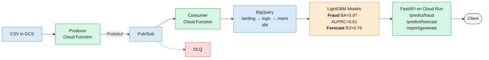
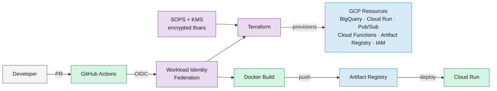

# Banking Fraud Detection Pipeline

[](https://github.com/mponsclo/banking-fraud-detection-pipeline/actions/workflows/lint.yml)
[](https://www.python.org/downloads/)
[](LICENSE)
[](https://github.com/astral-sh/ruff)
[](https://docs.getdbt.com/)
[](https://fastapi.tiangolo.com/)
[](https://cloud.google.com/)

End-to-end ML pipeline for detecting fraud in 13M credit card transactions (0.15% fraud rate) and forecasting client expenses. Data engineering with **dbt on BigQuery**, fraud detection with **LightGBM + Focal Loss**, expense forecasting with **direct multi-step regression**, served via **FastAPI on Cloud Run**, infrastructure managed with **Terraform**, CI/CD with **GitHub Actions + SOPS/KMS**.

> Built during a data science hackathon organized by NUWE in partnership with CaixaBank. The original datasets are not included (see [Data](#data)).

## Tech Stack

| Layer | Choice | Why |
|-------|--------|-----|
| Data warehouse | BigQuery | Serverless SQL, cheap on this data volume, nested records for event data |
| Transformation | dbt | Testable DAG, macros for BigQuery schema routing, lineage docs |
| Ingestion | Cloud Functions + Pub/Sub + Protobuf | Serverless streaming, typed schema, built-in DLQ |
| Model training | LightGBM | Fast on tabular data, handles extreme imbalance via focal loss |
| Serving | FastAPI on Cloud Run | Typed Pydantic I/O, scale-to-zero, cold-start fits a free tier |
| AI agent | LangChain + WeasyPrint | 3-layer LLM fallback (Vertex AI → Ollama → regex) + HTML/CSS PDF reports |
| IaC | Terraform (two-phase) | Bootstrap (local) + main (CI-applied) for a chicken-and-egg-free setup |
| Secrets | SOPS + GCP KMS | Encrypted `tfvars` in the repo, no plaintext, no stored keys |
| Auth (CI → GCP) | Workload Identity Federation | OIDC token exchange, no service account keys anywhere |
| Code quality | Ruff + pre-commit | One tool for lint + format, hooks mirror CI checks |
| CI/CD | GitHub Actions | Five workflows: lint, terraform validate/plan/apply, docker build+deploy |

## Results

| Task | Score Metric | Result |
|------|-------------|--------|
| 1. Data Queries | Exact match | 4/4 correct |
| 2. Data Functions | Pytest | 6/6 pass |
| 3. Fraud Detection | Balanced Accuracy | BA=0.97, AUPRC=0.61, Precision=0.64 / Recall=0.57 |
| 4. Expense Forecast | R2 Score | R2=0.76 (near theoretical ceiling) |
| 5. AI Agent | Pytest | 3/3 pass |

**5/5 tasks complete, 9/9 tests pass.**

---

## Documentation

| Guide | Description |
|-------|-------------|
| [Data Ingestion](docs/1-ingestion.md) | Cloud Functions + Pub/Sub streaming pipeline with Protobuf |
| [Data Transformation](docs/2-transformation.md) | dbt + BigQuery feature engineering (60+ features in SQL) |
| [Fraud Detection](docs/3-ml-fraud-detection.md) | LightGBM + Focal Loss model (9 experiments, AUPRC 0 &rarr; 0.61) |
| [Expense Forecasting](docs/4-ml-expense-forecast.md) | Direct multi-step forecasting + ceiling analysis (R2=0.76) |
| [API Serving](docs/5-serving.md) | FastAPI on Cloud Run with real-time predictions |
| [AI Agent](docs/6-agent.md) | Natural language report generation with 3-layer LLM fallback |
| [Infrastructure](docs/7-infrastructure.md) | Terraform, Workload Identity Federation, SOPS/KMS, CI/CD |
| [Experiments Log](docs/8-experiments.md) | Raw journal: 9 fraud + 2 forecast experiments with ablation studies |
| [Development & CI/CD](docs/9-development.md) | Makefile, Ruff, pre-commit, Dockerfile, GitHub Actions workflows |

**Notebooks:** [EDA](reports/01-eda-fraud-detection.ipynb) (fraud signal analysis) | [Model Results](reports/02-model-results.ipynb) (PR curves, feature importance, forecasts)

---

## Architecture

**Runtime data flow** — how a transaction becomes a prediction:



**Platform & CI/CD** — how the system is provisioned and deployed:



---

## Methodology

### Data Engineering (dbt + BigQuery)

Instead of ad-hoc pandas preprocessing, the data layer uses a **dbt pipeline** with BigQuery as the warehouse. Three datasets (`landing`, `logic`, `presentation`) with staging views, intermediate enrichment, and mart tables. The `mart_fraud_features` table computes 60+ features (velocity, behavioral, error flags, geographic anomaly) entirely in SQL via window functions. A custom `generate_schema_name` macro maps dbt models to BigQuery datasets cleanly.

### Fraud Detection (LightGBM + Focal Loss)

**9 experiments** documented in [docs/8-experiments.md](docs/8-experiments.md), from a naive baseline (AUPRC=0) to the final model:

| Technique | Impact |
|-----------|--------|
| EDA-driven features (errors column, geographic anomaly) | AUPRC 0 &rarr; 0.43 |
| Out-of-fold target encoding (MCC, merchant_id) | AUPRC 0.43 &rarr; 0.49 |
| Focal loss (replaced scale_pos_weight) | AUPRC 0.49 &rarr; 0.57 |
| Card age, gap z-score, spending anomaly features | AUPRC 0.57 &rarr; 0.61 |

**Final model:** LightGBM + Focal Loss (gamma=2.0, alpha=0.25) + target encoding. Production operating point: 64% precision, 57% recall.

### Expense Forecasting (Direct Multi-Step)

Global LightGBM with **direct multi-step forecasting** (separate model per horizon h=1,2,3). Walk-forward validated with 8 folds, reporting R2=0.76, MAE=$239, RMSE=$314.

### AI Agent (LangChain + Regex Fallback)

Hybrid architecture: 3-layer LLM strategy (Vertex AI Gemini scaffold, Ollama for local dev, regex fallback as default) + deterministic pipeline for client validation, data analysis, and professional PDF report generation. Regex fallback ensures all tests pass without LLM dependencies.

The report engine uses **Jinja2 + WeasyPrint** (HTML/CSS paged media) to produce 5-page bank-quality PDFs with a gradient cover page, KPI dashboard, styled data tables, and matplotlib charts. Showcase examples in [`reports/showcase/`](reports/showcase/).

### Infrastructure (Terraform + GCP)

Two-phase Terraform (bootstrap + main), Workload Identity Federation for keyless CI auth, SOPS/KMS-encrypted secrets. See [Infrastructure](docs/7-infrastructure.md) and [Development & CI/CD](docs/9-development.md) for details.

---

## Lessons Learned

### Catching Data Leakage via Ablation

Initial deep feature engineering produced AUPRC=0.89, a suspiciously large jump. An ablation study (adding features one at a time) isolated the leak: **zip-based features alone caused a +0.30 AUPRC jump**. The root cause was a `client_home_zip` CTE that computed each client's most frequent zip from ALL transactions including future ones. For a 2012 transaction, the model could see 2019 zip data. Further analysis confirmed the signal was inverted: fraud was actually MORE common at the home zip (0.21% vs 0.04%), meaning the model was using zip as a proxy for time period, not fraud risk. After removing zip features: honest AUPRC=0.61, still a +7% improvement over the prior experiment.

**Takeaway:** When using temporal data splits, validate that every feature is computable at prediction time using only historical data. Ablation studies are the fastest way to isolate leakage.

### Focal Loss > Class Weights for Extreme Imbalance

At a 0.15% fraud rate, the standard approach of tuning `scale_pos_weight` capped out at AUPRC=0.49. Switching to focal loss (gamma=2.0, alpha=0.25) jumped AUPRC to 0.58 (+19%), the single largest improvement from any experiment. The key insight: focal loss down-weights easy negatives so the gradient concentrates on hard-to-classify examples, while `scale_pos_weight` uniformly upweights all positives regardless of difficulty. Both precision and recall improved simultaneously, which is rare and signals a better-calibrated model.

### R2 Ceiling Analysis: Knowing When to Stop

Initial walk-forward validation reported R2=0.96. Deep audit found that 77% of total variance was between-client (spending level), not within-client temporal patterns. Per-client R2 median was 0.67, with 12% of clients having negative R2. After fixing data leakage in feature computation, honest R2 dropped to 0.76. Seven alternative approaches were tested (blending, residual modeling, two-stage, EWMA), all converging to ~0.76, confirming the ceiling. Within-client autocorrelation was ~0, YoY seasonality ~0, and 57% of clients had CV>0.7. The remaining ~24% variance is irreducible without external data.

**Takeaway:** When multiple fundamentally different approaches converge to the same metric, you've likely hit the dataset's ceiling. Variance decomposition (between vs. within) is a fast way to identify this.

### Failed Ensemble: Temporal Distribution Shift

Stacking (LightGBM + XGBoost + Logistic Regression meta-learner) with a 3-way temporal split caused AUPRC to collapse from 0.58 to 0.02. The stacking set landed in a period with 0.06% fraud (vs 0.15% base rate), creating a distribution shift that broke the meta-learner. Ensemble stacking with temporal data requires that train/stack/validation periods have comparable distributions, or you need stratified temporal sampling.

---

## Quick Start

```bash
# Clone and set up environment
git clone https://github.com/mponsclo/banking-fraud-detection-pipeline.git
cd banking-fraud-detection-pipeline
python -m venv venv && source venv/bin/activate

# Install dependencies
make install

# Authenticate and build data pipeline
gcloud auth application-default login
make load-data      # one-time: upload large CSVs to GCS + BigQuery
make dbt-build      # seed + run + test on BigQuery

# Train and export models
make export-models  # serialize to outputs/models/

# Run API locally
make serve          # http://localhost:8080/docs

# Run tests
make test           # 9/9 should pass

# Code quality
make lint           # ruff check + format check
make format         # auto-fix + format
```

---

## Build & Deploy

**Local toolchain** ([Makefile](Makefile), [pyproject.toml](pyproject.toml), [.pre-commit-config.yaml](.pre-commit-config.yaml), [Dockerfile](Dockerfile))

```bash
pre-commit install                 # hook: ruff check + ruff-format on every commit
make lint                          # ruff check + ruff format --check
make format                        # auto-fix and format
make docker-build && make docker-run  # reproduce the Cloud Run image locally
```

**CI/CD** ([.github/workflows/](.github/workflows/))

- [lint.yml](.github/workflows/lint.yml) — Ruff check + format on every PR and push to main
- [terraform-validate.yml](.github/workflows/terraform-validate.yml) — fmt + validate on infra PRs
- [terraform-plan.yml](.github/workflows/terraform-plan.yml) — WIF + SOPS, plan posted as PR comment
- [terraform-apply.yml](.github/workflows/terraform-apply.yml) — auto-apply on merge to main, gated by `production` environment
- [docker-build-deploy.yml](.github/workflows/docker-build-deploy.yml) — build, push to Artifact Registry, deploy to Cloud Run

**Secrets:** SOPS + GCP KMS encrypt `terraform/terraform.tfvars.enc`; only identities with `cloudkms.cryptoKeyDecrypter` can decrypt. See [.sops.yaml](.sops.yaml).

See [docs/9-development.md](docs/9-development.md) for the full dev + CI/CD guide.

---

## API Reference

```bash
# Health check
curl http://localhost:8080/health

# Fraud prediction
curl -X POST http://localhost:8080/predict/fraud \
  -H "Content-Type: application/json" \
  -d '{"transaction_id": "123", "amount": -150.0, "use_chip": "Online Transaction", "mcc": 5411, "merchant_id": 100, "is_online": 1, "txn_hour": 3, "credit_limit": 5000}'

# Expense forecast
curl -X POST http://localhost:8080/predict/forecast \
  -H "Content-Type: application/json" \
  -d '{"client_id": 0}'

# Report generation
curl -X POST http://localhost:8080/report/generate \
  -H "Content-Type: application/json" \
  -d '{"client_id": 0, "prompt": "Create a report for the fourth month of 2017"}'
```

---

## Data

The datasets are **not included** in this repository (too large for git, ~1.3GB total). To reproduce the results, you would need:

- `data/raw/transactions_data.csv` (~1.2GB, 13M rows): Credit card transactions dataset (2010s decade) with columns: transaction ID, client ID, card ID, amount, merchant, MCC code, timestamps, errors, etc.
- `data/raw/mcc_codes.json` (~6KB): Merchant Category Code mappings (109 categories).
- `data/raw/train_fraud_labels.json` (~100MB): Binary fraud labels for training the detection model.
- Client and card data were fetched from APIs (no longer available) and stored as `clients_data_api.csv` and `card_data_api.csv`.

The large CSV is loaded to GCS + BigQuery via `make load-data` (see [scripts/load_raw_data.sh](scripts/load_raw_data.sh)); smaller files are committed as dbt seeds.

---

## Project Structure

```
├── terraform/                  # Infrastructure as Code (GCP)
│   ├── bootstrap/              # One-time: project, KMS, SAs, WIF
│   └── modules/                # iam, kms, bigquery, cloud_run, artifact_registry,
│                               # workload_identity, pubsub, cloud_functions
├── .github/workflows/          # CI/CD: validate, plan, apply, deploy, lint
├── functions/                  # Cloud Functions (ingestion pipeline)
│   ├── producer/               # HTTP-triggered: reads CSV chunks, publishes Protobuf to Pub/Sub
│   └── consumer/               # EventArc-triggered: deserializes Protobuf, streams to BigQuery
├── proto/                      # Protobuf schema (transaction.proto) + compiler script
├── app/                        # FastAPI serving layer
│   └── routers/                # health, fraud, forecast, agent
├── dbt/                        # dbt-BigQuery data pipeline
│   ├── models/                 # staging → intermediate → marts
│   ├── seeds/                  # Reference data (MCC codes, users, cards)
│   └── macros/                 # BigQuery schema routing
├── scripts/                    # Data loading + model export
├── src/                        # ML models + agent (hackathon code, DuckDB for tests)
│   ├── data/                   # Task 1 queries, Task 2 functions
│   ├── models/                 # Task 3 fraud model, Task 4 forecast model
│   └── agent/                  # Task 5 AI agent
│       ├── templates/          # Jinja2 HTML + CSS for PDF reports
│       └── fonts/              # Bundled Inter font (SIL OFL)
├── reports/                    # EDA notebook + model results notebook
│   └── showcase/               # 3 example PDF reports
├── tests/                      # Hackathon test suite (9 tests)
├── docs/                       # Component guides (1-ingestion through 9-development)
├── Dockerfile                  # python:3.10-slim + uvicorn + WeasyPrint deps
├── Makefile                    # install, dbt-build, export-models, serve, lint, test
└── pyproject.toml              # Ruff linter configuration
```

---

## License

[MIT](LICENSE)
