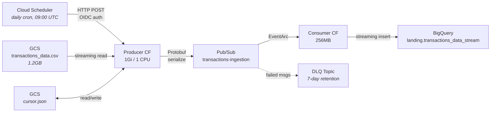

# Data Ingestion Pipeline

Cloud Scheduler → Producer Cloud Function → Pub/Sub (Protobuf) → Consumer Cloud Function → BigQuery

## Why This Layer Exists

The rest of this project loads data into BigQuery via a one-time `bq load` from a local CSV. That works, but it's not how data moves in production. In a real banking system, transactions arrive continuously -- from payment processors, ATM networks, mobile apps -- and they need to land in the warehouse reliably, in near real-time, without someone running a shell script.

This ingestion pipeline exists to illustrate that flow. It takes the same 1.2GB CSV that was previously bulk-loaded and replays it through a proper event-driven architecture: a scheduled producer reads chunks from GCS, publishes each transaction as a structured message to Pub/Sub, and a consumer streams them into BigQuery. The data is the same; the path it takes is what matters.

The goal isn't to replace the batch load -- it's to show how you'd build the pipeline if transactions were arriving continuously. Everything is deployed with Terraform, runs on GCP's Always Free tier, and can be paused or resumed with a single command.

## Architecture



The pipeline processes the CSV in time-ordered 30-day chunks. Each invocation publishes one month of transactions (~100K rows) as Protobuf messages to Pub/Sub. A consumer function picks up each message and streams it into BigQuery.

## Key Concepts

### Protocol Buffers (Protobuf)

Protobuf is Google's binary serialization format. You define a schema in a `.proto` file, compile it to your language of choice (Python in our case), and then use the generated code to serialize and deserialize data.

The key difference from JSON: Protobuf is **schema-first**. You can't publish a message without defining its structure upfront. This catches format mismatches between producer and consumer at compile time, not at 3 AM when the pipeline breaks.

How it works in this pipeline:

1. **Define the schema** in [`proto/transaction.proto`](../proto/transaction.proto):

```protobuf
message Transaction {
  int64 id = 1;
  string date = 2;           // "2010-01-01 00:01:00"
  string amount = 5;         // "$-77.00" (raw, parsed downstream by dbt)
  string use_chip = 6;       // "Chip Transaction" | "Swipe Transaction" | "Online Transaction"
  int64 mcc = 11;            // Merchant Category Code
  string errors = 12;        // error type or empty
  // ... 6 more fields
}
```

2. **Compile** with `protoc` (or `make proto-compile`), which generates a Python class `Transaction` with typed fields and `.SerializeToString()` / `.ParseFromString()` methods.

3. **Producer serializes**: reads a CSV row, populates a `Transaction` object, calls `.SerializeToString()` → produces a compact binary blob (~40% smaller than the equivalent JSON).

4. **Consumer deserializes**: receives the binary blob from Pub/Sub, calls `.ParseFromString()` → gets back the typed `Transaction` object with all fields accessible.

Why not just JSON? JSON would work fine here. But Protobuf gives you three things: enforced schema (can't accidentally send a string where an int is expected), smaller messages (less Pub/Sub egress), and schema evolution (you can add fields later without breaking the consumer). For a pipeline that moves millions of messages, these properties matter.

Fields intentionally preserve the raw CSV format. Parsing (e.g., `"$-77.00"` to float) is handled downstream by dbt's staging layer, keeping the ingestion pipeline format-agnostic.

### EventArc

EventArc is GCP's eventing layer -- it connects event sources (like a Pub/Sub topic) to event handlers (like a Cloud Function). Think of it as the glue between "a message arrived" and "run this code."

In this pipeline, EventArc does the following:

1. A message lands on the `transactions-ingestion` Pub/Sub topic
2. EventArc detects it and wraps the message in a [CloudEvent](https://cloudevents.io/) envelope (a standardized event format)
3. EventArc delivers the CloudEvent to the consumer Cloud Function via HTTP
4. The consumer extracts the original Pub/Sub message data from the CloudEvent, base64-decodes it, and deserializes the Protobuf

We use EventArc instead of a plain Pub/Sub pull subscription because Gen2 Cloud Functions are built on Cloud Run under the hood. EventArc is the recommended way to connect Pub/Sub to Gen2 functions -- it handles the subscription creation, authentication, and retry logic automatically.

The retry policy is set to `RETRY_POLICY_RETRY`, meaning failed messages are redelivered until they succeed or exhaust the retry window. Messages that completely fail end up in the Dead Letter Queue.

## Design Decisions

### Why time-based chunking

The CSV has 13.3M rows spanning 3,590 days (Jan 2010 -- Oct 2019). Loading everything at once would:

1. Exceed Cloud Function memory (even at 1Gi, the full CSV is 1.2GB)
2. Publish 13M Pub/Sub messages in one burst, overwhelming the consumer
3. Take longer than the 5-minute Cloud Function timeout

Instead, each invocation processes a **30-day window** (~100K rows). The cursor advances after each successful batch, so the next invocation picks up where it left off. At one invocation per day, the full dataset ingests in ~120 days -- but the schedule can be accelerated for faster replay.

### Cursor tracking in GCS

State is tracked via a simple JSON file in GCS:

```json
{"last_timestamp": "2010-01-30 23:59:00"}
```

Why GCS instead of a database or Firestore:
- **No extra service** -- reuses the existing GCS bucket (`mpc-caixabank-ai-raw-data`)
- **Atomic reads/writes** -- a single JSON object, no concurrency issues with max_instance_count=1
- **Inspectable** -- `gsutil cat gs://bucket/pipeline/cursor.json` shows exactly where ingestion stopped

One subtlety: the cursor always advances to `chunk_end` even if zero rows are found in that time window. Without this, an empty date range would cause the producer to re-scan the same window forever.

### Dead Letter Queue

The DLQ topic (`transactions-ingestion-dlq`) catches messages that exhaust EventArc's retry policy. In practice, failures are rare -- the consumer's only operation is a BigQuery streaming insert -- but the DLQ is a standard production pattern:

- Main topic: **no retention** (messages consumed immediately)
- DLQ topic: **7-day retention** (enough time to investigate and replay failed messages)

In a real system, you'd have monitoring on the DLQ and an alert that fires when messages start landing there.

## Code Walkthrough

### Producer ([`functions/producer/main.py`](../functions/producer/main.py))

The producer is an HTTP-triggered Cloud Function called by Cloud Scheduler. Its flow:

1. **Read cursor** from GCS -- get the last processed timestamp
2. **Stream the CSV** from GCS line-by-line using `blob.open("r")` (never loads the full 1.2GB into memory)
3. **Skip rows** at or before the cursor timestamp (string comparison works because timestamps are ISO-formatted)
4. **Stop** when rows exceed `cursor + CHUNK_DAYS`
5. **Serialize** each row to a Protobuf `Transaction` message
6. **Publish** to Pub/Sub, collecting futures for async confirmation
7. **Wait** for all publishes to complete
8. **Update cursor** in GCS

A few things worth noting:

- **Streaming reads**: The first version used `blob.download_as_text()`, which loaded the entire 1.2GB CSV into memory. The function had 512MB. It crashed immediately. Switching to `blob.open("r")` fixed it -- Python reads line by line from a GCS stream, keeping memory roughly constant regardless of file size.
- **Error handling**: Malformed rows are logged and skipped, not crashed on. One bad row doesn't lose the entire batch of 100K messages.
- **String timestamp comparison**: Since the CSV is ordered by timestamp and the format is ISO (`YYYY-MM-DD HH:MM:SS`), string comparison preserves chronological order. This avoids parsing 13M timestamps into datetime objects just to skip past the cursor.

### Consumer ([`functions/consumer/main.py`](../functions/consumer/main.py))

The consumer is simpler. It's triggered by EventArc on each Pub/Sub message:

1. **Decode** the base64-encoded Pub/Sub message data from the CloudEvent envelope
2. **Deserialize** the Protobuf `Transaction` message
3. **Convert** to a BigQuery row dict (handling type conversions like `zip` string → float)
4. **Streaming insert** to `landing.transactions_data_stream`

The `_safe_float()` helper handles the zip field gracefully -- empty strings become `None`, invalid values don't crash the function. This matters because online transactions have no zip code.

## Terraform Deployment

### Modules

Two Terraform modules manage the pipeline:

**[`terraform/modules/pubsub/`](../terraform/modules/pubsub/)** -- Creates the ingestion topic and DLQ topic.

**[`terraform/modules/cloud_functions/`](../terraform/modules/cloud_functions/)** -- The most complex module in the project:

- **Source packaging**: `archive_file` data source zips the function directories, `google_storage_bucket_object` uploads them with a content-hash in the filename. When code changes, the hash changes, and Terraform knows to redeploy.
- **Producer function**: HTTP trigger, 1Gi memory, 1 CPU, 300s timeout
- **Consumer function**: EventArc Pub/Sub trigger, 256MB, 60s timeout, max 3 instances
- **Cloud Scheduler**: Daily cron at 09:00 UTC with OIDC authentication (the scheduler authenticates to the function, not just calls it blindly)
- **Pub/Sub service agent IAM**: Grants `roles/iam.serviceAccountTokenCreator` to the Pub/Sub service agent -- required for EventArc to push messages to Gen2 functions with authentication

### IAM

The pipeline uses a dedicated `pipeline-sa` service account with least-privilege roles:

| Role | Purpose |
|------|---------|
| `bigquery.dataEditor` | Write to `landing.transactions_data_stream` |
| `bigquery.jobUser` | Run streaming insert jobs |
| `pubsub.publisher` | Publish messages to topic |
| `pubsub.subscriber` | EventArc subscription |
| `run.invoker` | Scheduler invokes producer; EventArc invokes consumer |
| `eventarc.eventReceiver` | Receive EventArc triggers |
| `storage.objectAdmin` | Read CSV + read/write cursor in GCS |

## Lessons Learned During Deployment

These are the things that weren't obvious from the documentation and cost real debugging time:

1. **Cloud Scheduler region**: `europe-southwest1` (Madrid) doesn't support Cloud Scheduler. The scheduler job runs in `europe-west1` while the functions stay in `europe-southwest1`. Cross-region HTTP calls work fine -- it's just a URL.

2. **Memory sizing**: 512MB seemed enough for streaming reads, but Python's CSV reader still buffers internally. The function crashed on the first invocation. 1Gi with 1 CPU resolved it. Worth noting: Cloud Run (which Gen2 functions run on) requires at least 1 CPU for 1Gi memory -- you can't just bump memory alone.

3. **Cloud Build permissions**: Gen2 Cloud Functions build their container images using Cloud Build behind the scenes. The default compute service account needs `roles/cloudbuild.builds.builder` for this to work. This isn't prominently documented and caused deployment failures until manually granted via `gcloud`.

4. **Consumer backpressure**: Publishing 97K messages in a burst overwhelmed the consumer at max 3 instances. Many messages got "no available instance" errors. EventArc's retry policy handled it -- messages were redelivered until the consumer caught up -- but in production you'd increase `max_instance_count` or have the consumer batch multiple messages per invocation.

5. **Cursor overwrite permissions**: `storage.objectCreator` lets you create new objects but not overwrite existing ones. Overwriting requires `storage.objects.delete` (to delete the old version first). We ended up using `storage.objectAdmin` which covers both.

## Running Manually

```bash
# Compile Protobuf schema
make proto-compile

# Trigger producer (requires gcloud auth)
make trigger-ingestion

# Check cursor state
gsutil cat gs://mpc-caixabank-ai-raw-data/pipeline/cursor.json

# Check ingested rows
bq query --use_legacy_sql=false \
  "SELECT COUNT(*) FROM landing.transactions_data_stream"

# Pause/resume scheduler
gcloud scheduler jobs pause daily-transaction-ingestion --location=europe-west1
gcloud scheduler jobs resume daily-transaction-ingestion --location=europe-west1
```
