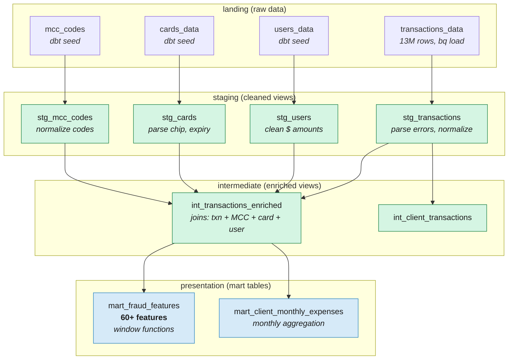

# Data Transformation with dbt + BigQuery

Layered SQL transformations from raw CSVs to ML-ready feature tables.

## Architecture



## Three-Layer Architecture

The pipeline follows the staging → intermediate → marts pattern across three BigQuery datasets:

| Layer | Dataset | Materialization | Purpose |
|-------|---------|----------------|---------|
| **Staging** | `landing` | Views | Clean, parse, normalize raw data |
| **Intermediate** | `logic` | Views | Join master data, derive base features |
| **Marts** | `presentation` | Tables | Final feature engineering for ML models |

A custom [`generate_schema_name`](../dbt/macros/generate_schema_name.sql) macro maps dbt's `+schema` config directly to BigQuery dataset names. Without it, dbt would generate compound names like `landing_staging` instead of just `landing`.

## Staging Layer

Four views that clean raw data without changing its grain (one row per source row):

### stg_transactions

The most important staging model. Transforms the raw `transactions_data` table:

- **Renames**: `id` → `transaction_id`, `date` → `transaction_date`
- **Parses error flags**: The raw `errors` column is a string (e.g., `"Bad CVV"`). The staging model parses it into 7 boolean columns using `IF()`:

```sql
IF(LOWER(COALESCE(errors, '')) LIKE '%bad cvv%', 1, 0) AS has_bad_cvv
```

This produces: `has_bad_cvv`, `has_bad_expiration`, `has_bad_card_number`, `has_bad_pin`, `has_insufficient_balance`, `has_technical_glitch`, `has_any_error`.

- **Derives channel**: `IF(use_chip = 'Online Transaction', 1, 0) AS is_online`
- **Casts types**: `SAFE_CAST(zip AS STRING)` for safe type conversion

### stg_users, stg_cards, stg_mcc_codes

Clean demographic and reference data: parse `$`-prefixed currency strings to FLOAT64 with `SAFE_CAST`, normalize boolean fields (`"YES"/"NO"` → BOOLEAN), extract dates from `MM/YYYY` strings.

## Intermediate Layer

Two views that enrich transactions with master data:

### int_transactions_enriched

Joins all four staging views into a single denormalized view: transactions + MCC category names + card attributes (chip, credit limit, card brand/type, expiry) + user demographics (age, income, credit score, debt). This is the foundation for all downstream features.

### int_client_transactions

Client-level transaction view with user and card attributes joined, used for behavioral features.

## Marts Layer

### mart_fraud_features (60+ columns)

The centerpiece of the project: [`dbt/models/marts/mart_fraud_features.sql`](../dbt/models/marts/mart_fraud_features.sql). Computes 60+ features across 8 categories, all in SQL via window functions:

| Category | Count | Key Features | Why They Matter |
|----------|-------|-------------|----------------|
| **Amount** | 10 | `abs_amount`, `log_amount`, `amount_zscore`, `client_avg_amount_last50`, `amount_vs_client_max`, `above_client_p90`, `amount_to_limit_ratio` | Unusual amounts relative to client history signal fraud |
| **Time** | 5 | `txn_hour`, `txn_day_of_week`, `txn_month`, `txn_year`, `is_weekend` | Fraud clusters at unusual hours (3-5 AM) |
| **Errors** | 7 | `has_bad_cvv`, `has_bad_expiration`, `has_bad_pin`, `has_insufficient_balance`, `has_any_error`, `card_errors_7d` | Bad CVV = 23x base fraud rate (from EDA) |
| **Velocity** | 5 | `seconds_since_last_txn`, `card_txn_count_1h`, `card_txn_count_24h`, `card_txn_count_7d`, `card_amount_sum_24h` | Rapid successive transactions signal card testing |
| **Behavioral** | 7 | `card_mcc_freq`, `card_merchant_freq`, `card_distinct_mcc_7d`, `is_new_merchant`, `is_new_mcc`, `rapid_succession` | New merchant + new MCC = higher risk |
| **Geographic** | 2 | `is_online`, `is_out_of_home_state` | Online transactions = 28x fraud rate vs swipe (from EDA) |
| **Card/User** | 8 | `credit_limit`, `card_has_chip`, `card_age_months`, `credit_score`, `total_debt`, `yearly_income`, `debt_to_income_ratio` | Card age and credit profile correlate with fraud risk |
| **Combined Signals** | 4 | `online_new_merchant`, `online_high_amount`, `oos_new_merchant`, `error_online` | Interaction features that capture compound risk |

### Key SQL Patterns

**Named windows for velocity features:**

BigQuery's `RANGE BETWEEN` requires a numeric ORDER BY column. Timestamps don't work directly, so we convert to epoch seconds. Named `WINDOW` clauses keep things readable when the same partitioning is reused across multiple features:

```sql
SELECT
    *
    , COUNT(*) OVER card_1h - 1 AS card_txn_count_1h
    , COUNT(*) OVER card_24h - 1 AS card_txn_count_24h
    , COUNT(*) OVER card_7d - 1 AS card_txn_count_7d
    , SUM(ABS(amount)) OVER card_24h - ABS(amount) AS card_amount_sum_24h
FROM base
WINDOW
    card_1h AS (PARTITION BY card_id ORDER BY txn_epoch RANGE BETWEEN 3600 PRECEDING AND CURRENT ROW),
    card_24h AS (PARTITION BY card_id ORDER BY txn_epoch RANGE BETWEEN 86400 PRECEDING AND CURRENT ROW),
    card_7d AS (PARTITION BY card_id ORDER BY txn_epoch RANGE BETWEEN 604800 PRECEDING AND CURRENT ROW)
```

This counts transactions per card in rolling 1-hour, 24-hour, and 7-day windows, computed entirely in SQL without Python.

**QUALIFY for CTE simplification:**

The `client_home_state` and `client_home_zip` CTEs compute each client's most frequent value. Instead of nesting a subquery with `ROW_NUMBER()` and filtering with `WHERE rn = 1`, we use `QUALIFY` to do it in a single pass:

```sql
WITH client_home_state AS (
    SELECT
        client_id
        , merchant_state AS home_state
    FROM {{ ref('stg_transactions') }}
    WHERE TRUE
      AND merchant_state IS NOT NULL
      AND merchant_state != ''
    GROUP BY ALL
    QUALIFY ROW_NUMBER() OVER (PARTITION BY client_id ORDER BY COUNT(*) DESC) = 1
)
```

**IF() for boolean features:**

Simple two-outcome conditions use `IF()` instead of the more verbose `CASE WHEN ... THEN ... ELSE ... END`:

```sql
, IF(EXTRACT(DAYOFWEEK FROM t.transaction_date) IN (1, 7), 1, 0) AS is_weekend
, IF(card_merchant_freq = 0, 1, 0) AS is_new_merchant
, IF(has_any_error = 1 AND is_online = 1, 1, 0) AS error_online
```

`CASE WHEN` is reserved for multi-condition logic like `card_age_months` (date parsing with NULL handling).

**COUNTIF and SUM(IF()) for conditional aggregation:**

In `mart_client_monthly_expenses`, conditional aggregation avoids verbose `CASE WHEN` inside aggregate functions:

```sql
, SUM(IF(amount < 0, ABS(amount), 0)) AS total_expenses
, COUNTIF(amount < 0) AS num_expense_transactions
, AVG(IF(amount < 0, ABS(amount), NULL)) AS avg_expense_amount
```

### mart_client_monthly_expenses

A simpler mart for expense forecasting (Task 4). Aggregates per client per month using `GROUP BY ALL`:

- `total_expenses` (sum of negative amounts)
- `total_earnings` (sum of positive amounts)
- `num_expense_transactions`, `avg_expense_amount`, `max_expense_amount`
- `total_transactions`

## Design Decisions

### Why BigQuery over DuckDB for production

The codebase has a **dual-path architecture**:

- **Production path**: dbt on BigQuery → `scripts/export_models.py` → `app/` (FastAPI on Cloud Run)
- **Hackathon path**: DuckDB local → `src/models/train_model.py` → `tests/`

BigQuery was chosen for production because it scales to billions of rows without memory concerns, integrates with the GCP ecosystem (Cloud Run, Cloud Functions, IAM), and dbt-bigquery handles schema management, incremental builds, and data tests. Window functions on 13M rows complete in seconds.

### LOGICAL billing model

BigQuery datasets use `LOGICAL` storage billing (not `PHYSICAL`). At small scale (<1TB), the time-travel and fail-safe overhead of PHYSICAL billing (~30-40%) exceeds compression savings. This is configured in the [BigQuery Terraform module](../terraform/modules/bigquery/main.tf).

### SQL style conventions

The SQL in this project follows a consistent style:

- **UPPER case** for all keywords (`SELECT`, `FROM`, `WHERE`, `IF`, `OVER`, etc.)
- **Leading commas** in SELECT lists (easier to comment out lines, cleaner diffs)
- **`WHERE TRUE`** followed by conditions on new lines (makes adding/removing filters trivial)
- **`GROUP BY ALL`** instead of listing columns explicitly
- **`IF()`** for two-outcome conditions, `CASE WHEN` only for 3+ branches
- **`COUNTIF()`**, **`SUM(IF())`** for conditional aggregation
- **`SAFE_CAST`** for user-facing data conversions
- **Named `WINDOW`** clauses to avoid repeating partition definitions
- **`QUALIFY`** to filter window function results without nesting

## Running dbt

> **Prerequisites:** You need a GCP project with BigQuery enabled and `gcloud auth application-default login` configured. See the [Infrastructure guide](infrastructure.md) for full setup.

```bash
# Full pipeline: seed reference data + run models + run tests
make dbt-build

# Individual steps
make dbt-seed    # Load seeds (users, cards, MCC codes) into landing
make dbt-run     # Run all models (staging → intermediate → marts)
make dbt-test    # Run schema tests

# Rebuild a single model
cd dbt && dbt run --select mart_fraud_features --profiles-dir .
```

All commands run from the `dbt/` directory with `--profiles-dir .` to use the local [`profiles.yml`](../dbt/profiles.yml).

## Known Limitations

1. **`is_out_of_home_state` has mild leakage**: the client home state is computed from ALL transactions including future ones. Kept for consistency across experiments (documented in [experiments.md](../experiments.md)).

2. **COUNT(DISTINCT) features are approximate**: correlated subqueries on 13M rows time out in BigQuery for some clients. In production, use `APPROX_COUNT_DISTINCT` or a feature store.

3. **No incremental materialization**: marts are full rebuilds. For a production pipeline ingesting daily data, switch to `materialized='incremental'` with `unique_key='transaction_id'`.
