# Fraud Detection Model

LightGBM + Focal Loss + Out-of-Fold Target Encoding on 13M transactions with 0.15% fraud rate.

## Why This Model Exists

The [EDA notebook](../reports/01-eda-fraud-detection.ipynb) showed that fraud patterns exist in the data (error flags at 23x, online channel at 28x, temporal peaks at night), but they're hidden inside a 0.15% fraud rate. No simple rule or threshold can reliably separate fraud from legitimate transactions across 60+ features. You need a model that can learn non-linear interactions between features while handling extreme class imbalance.

This document covers the 9-experiment journey from a naive baseline (AUPRC near zero) to a production-grade model (AUPRC=0.61, BA=0.97), including the techniques that worked, the approaches that failed, and a data leakage incident caught via ablation study.

## Problem

13.3 million credit card transactions spanning 2010 to 2019. Fraud rate: **0.15%** (1 in 665 transactions). A model that predicts "no fraud" for every transaction achieves 99.85% accuracy but catches zero fraud.

### Metrics

**AUPRC (Area Under Precision-Recall Curve)**: the primary metric for imbalanced classification. It summarizes the tradeoff between precision and recall across all thresholds. A random classifier scores equal to the fraud rate (0.0015), so any score above that represents learned signal.

$$\text{Precision} = \frac{TP}{TP + FP} \qquad \text{Recall} = \frac{TP}{TP + FN}$$

AUPRC is the area under the curve of Precision (y-axis) vs Recall (x-axis) as the decision threshold varies from 0 to 1.

**Balanced Accuracy**: the hackathon evaluation metric. It averages the recall of each class, so both fraud and non-fraud detection matter equally:

$$\text{BA} = \frac{1}{2}\left(\frac{TP}{TP + FN} + \frac{TN}{TN + FP}\right)$$

**F1 Score**: the harmonic mean of precision and recall, used to select the production operating threshold:

$$F_1 = 2 \cdot \frac{\text{Precision} \cdot \text{Recall}}{\text{Precision} + \text{Recall}}$$

## Background: LightGBM

[LightGBM](https://lightgbm.readthedocs.io/) is a gradient boosting framework that builds an ensemble of decision trees sequentially. Each tree corrects the errors of the previous ones by fitting the gradient of the loss function. Compared to other boosting libraries (XGBoost, CatBoost), LightGBM is faster because it uses histogram-based splitting and a leaf-wise growth strategy instead of level-wise.

Why LightGBM for this problem:
- **Handles mixed feature types natively**: categorical columns (`use_chip`, `card_brand`) are split directly without one-hot encoding
- **Efficient on large datasets**: 13M rows train in minutes, not hours
- **Supports custom objectives**: we plug in a focal loss function directly (see below)
- **Robust to missing values**: NaN features (e.g., `seconds_since_last_txn` for a client's first transaction) are handled without imputation

## The Experiment Journey

9 experiments, from underfitting to production-grade. Full details in [`experiments.md`](../experiments.md).

| Exp | Change | AUPRC | Key Insight |
|-----|--------|-------|-------------|
| 1 | Naive LightGBM baseline | ~0 | No features, no class handling |
| 2 | `scale_pos_weight=10` | 0.22 | Class weights help but plateau |
| 3 | Velocity features | 0.21 | Features alone aren't enough without proper imbalance handling |
| 4 | EDA-driven features (errors, geographic) | 0.43 | **Biggest jump**: `has_bad_cvv` = 23x fraud rate, `is_online` = 28x |
| 5 | Out-of-fold target encoding | 0.49 | `mcc_te` became #1 feature (importance 2818) |
| 6 | **Focal loss** (gamma=2.0, alpha=0.25) | 0.58 | **+19%**: both precision and recall improved |
| 7 | Ensemble stacking | 0.02 | **Failed**: temporal distribution shift broke the meta-learner |
| 8 | Deep features + leakage detection | 0.61 | Zip features leaked (+0.30 AUPRC); ablation study caught it |
| 9 | Behavioral patterns | 0.60 | 9 new features added noise; LightGBM already captures interactions |

**Final model:** Exp 8 (fixed). BA=0.97, AUPRC=0.61, F1=0.60. Production operating point: **64% precision, 57% recall** (for every 10 alerts, ~6 are real fraud; we catch 57% of all fraud).

## Key Techniques

### Focal Loss

The single largest improvement (+19% AUPRC). Replaced `scale_pos_weight` tuning entirely.

Focal loss was originally introduced by [Lin et al. (2017)](https://arxiv.org/abs/1708.02002) for object detection in computer vision, where background pixels vastly outnumber object pixels. The same imbalance structure applies to fraud detection.

The standard cross-entropy loss treats every sample equally:

$$\text{CE}(p_t) = -\log(p_t)$$

where $p_t$ is the model's predicted probability for the true class. Focal loss adds a modulating factor:

$$\text{FL}(p_t) = -\alpha \cdot (1 - p_t)^\gamma \cdot \log(p_t)$$

- When the model is **confident and correct** ($p_t$ close to 1): $(1 - p_t)^\gamma$ approaches 0, so the loss is near zero. The model doesn't waste gradient on examples it already gets right.
- When the model is **wrong** ($p_t$ close to 0): $(1 - p_t)^\gamma$ approaches 1, so the loss is full strength. The gradient concentrates on the hard examples.
- $\gamma = 2.0$ controls how aggressively easy examples are down-weighted.
- $\alpha = 0.25$ balances the relative weight of the positive vs negative class.

**Why `scale_pos_weight` isn't enough:** It uniformly upweights ALL positive samples by a constant factor. Easy-to-classify fraud gets the same weight as hard-to-classify fraud. Focal loss is strictly more nuanced because it adapts per-example based on difficulty.

LightGBM accepts custom objectives, so the focal loss integrates directly via `focal_loss_objective` and `focal_loss_eval` in [`src/models/train_model.py`](../src/models/train_model.py). One important consequence: focal loss returns raw logits, not probabilities. The serving layer must apply sigmoid ($p = 1 / (1 + e^{-x})$) to convert to [0, 1].

### Out-of-Fold Target Encoding

Categorical features `mcc` (Merchant Category Code) and `merchant_id` have thousands of unique values. One-hot encoding would create thousands of sparse columns. Target encoding replaces each category with its smoothed fraud rate, collapsing high-cardinality categoricals into a single numeric column.

The naive approach (compute fraud rate per category on the full training set) leaks the target into the features. Out-of-fold encoding prevents this:

1. Split training data into K folds
2. For each fold, compute the smoothed fraud rate from the OTHER K-1 folds
3. Apply to the held-out fold
4. For test/serving data, use the full training set mapping

The smoothing formula prevents overfitting on rare categories:

$$\text{encoded} = \frac{n_{\text{fraud}} + \alpha \cdot \mu_{\text{global}}}{n_{\text{total}} + \alpha}$$

where $\alpha = 10$ pulls categories with few observations toward the global mean $\mu_{\text{global}}$. A merchant with 3 transactions and 1 fraud isn't reliably "33% fraudulent"; the smoothing tempers that to something closer to the global average.

After target encoding, `mcc_te` became the #1 feature by importance (2818 splits). The model learned which merchant categories are riskiest.

### Feature Engineering from EDA

The biggest improvements came from domain-informed features, not model tuning:

- **Error flags** (Exp 4): EDA showed `has_bad_cvv` transactions have 23x the base fraud rate. Parsing the raw error string into 7 boolean columns was the highest-ROI feature work.
- **Channel features** (Exp 4): `is_online` transactions have 28x the fraud rate vs. swipe transactions.
- **Combined signals** (Exp 8): `online_new_merchant` (online AND first time at this merchant) captures a compound risk pattern the model can't easily learn from individual features.

See the [EDA notebook](../reports/01-eda-fraud-detection.ipynb) for the full analysis behind these features, and the [transformation guide](2-transformation.md) for how they're computed in SQL.

## Leakage Detection

### The zip feature incident

Experiment 8 initially produced AUPRC=0.89, a suspiciously large jump from 0.58. The ablation study (adding one feature at a time) revealed the source:

| Feature | AUPRC | Delta |
|---------|-------|-------|
| Baseline (Exp 6) | 0.5724 | |
| **+is_different_zip** | **0.8726** | **+0.30 LEAKAGE** |
| +oos_new_merchant | 0.6028 | +0.030 (legitimate) |
| +gap_zscore | 0.5821 | +0.010 |

**Root cause:** The `client_home_zip` CTE in the dbt mart computed each client's most frequent zip from ALL transactions, past AND future. For a 2012 training transaction, the model could see zip patterns from 2019. Since the train/val split is temporal, the zip features became a proxy for "which time period is this from?", not genuine fraud signal.

**Confirmation:** `is_different_zip` had an **inverse** correlation with fraud. Fraud was MORE common at the home zip (0.21% vs 0.04% elsewhere). The model was exploiting the temporal leak, not geographic patterns.

**Fix:** Removed all zip-based features. Honest AUPRC dropped to 0.61, still +7% over the prior experiment from legitimate features (card_age_months, gap_zscore, oos_new_merchant).

**Lesson:** When using temporal data splits, validate that every feature is computable at prediction time using only historical data. Ablation studies are the fastest diagnostic.

### Temporal validation

The model uses an 85/15 temporal split (not random). Training data comes from earlier time periods; validation from later periods. This prevents the model from learning patterns that wouldn't exist at serving time.

All `shift()` operations use `shift(1)` or `shift(lag)` to ensure features are computed from past data only.

## Failed Approaches

### Ensemble stacking (Exp 7)

LightGBM + XGBoost + Logistic Regression meta-learner with a 3-way temporal split (70/15/15). AUPRC collapsed from 0.58 to 0.02.

**Root cause:** The stacking set (middle 15%) landed in a period with 0.06% fraud rate (vs 0.15% overall). The meta-learner trained on a fundamentally different distribution than the validation set.

**Lesson:** Ensemble stacking with temporal data requires comparable fraud rates across all splits, or you need stratified temporal sampling.

### Behavioral features (Exp 9)

Added 9 features: `spend_acceleration`, `channel_switched`, `card_testing_pattern`, `burst_diversity`, etc. AUPRC decreased from 0.6149 to 0.6045.

**Lesson:** LightGBM already captures non-linear interactions between existing features. Explicit interaction features can add noise without signal. Only `prev_txn_amount` barely contributed.

## Production Operating Point

The model optimizes two thresholds:

- **BA-optimal** (threshold=0.08): BA=0.97, Recall=0.98. Catches almost all fraud but floods analysts with false positives.
- **F1-optimal** (threshold=0.37): F1=0.60, **Precision=0.64, Recall=0.57**. The production operating point.

At the production threshold: for every 10 flagged transactions, ~6 are actual fraud. The model catches 57% of all fraud. This is a usable system for a fraud investigation team.

## Serving via FastAPI

The trained model is served through a FastAPI endpoint on Cloud Run at `/predict/fraud`. See [`app/routers/fraud.py`](../app/routers/fraud.py) for the full implementation.

### How a request flows

1. **Client sends a POST** with transaction features (amount, use_chip, mcc, merchant_id, txn_hour, etc.)
2. **Feature vector construction**: the endpoint computes derived features inline (`abs_amount`, `log_amount`, `is_expense`, `amount_to_limit_ratio`)
3. **Target encoding at serving time**: the pre-computed encoding maps (loaded at startup from `target_encodings.pkl`) look up the smoothed fraud rate for the transaction's `mcc` and `merchant_id`. Unseen categories fall back to the global mean, so new merchants don't crash the API.
4. **Missing feature padding**: the model was trained on 55 features, but the API only receives a subset. Missing columns are filled with 0.
5. **Prediction**: `model.predict(df)` returns a raw logit (because focal loss is the objective)
6. **Sigmoid correction**: the logit is converted to a probability via $p = 1 / (1 + e^{-x})$
7. **Threshold decision**: if $p \geq 0.35$, the transaction is flagged as fraud

### How this would work in production

The current implementation is a synchronous API that processes one transaction at a time. In a real production system, several things would change:

**Model loading.** Models are currently baked into the Docker image as `.pkl` files. In production, they would live in a model registry (e.g., Vertex AI Model Registry) with versioning, A/B testing, and rollback. The API would load models from the registry at startup, and model updates would not require a new Docker build.

**Feature computation.** The API currently receives pre-computed features from the client. In production, the API would receive raw transaction data and compute features in real-time. Velocity features (`card_txn_count_24h`, `seconds_since_last_txn`) would come from a feature store (e.g., Vertex AI Feature Store or Redis) that maintains rolling aggregates as events arrive, rather than being recomputed from BigQuery on every request.

**Batch vs real-time.** The current API serves individual predictions. For high-throughput scenarios (thousands of transactions per second), you'd use batch prediction via Cloud Run Jobs or Dataflow, or switch to an async pattern where transactions are scored via Pub/Sub and results written to BigQuery.

**Monitoring.** There is no prediction logging or model monitoring today. In production, every prediction would be logged to a BigQuery `predictions_log` table with the input features, raw score, and decision. A scheduled job would compute Population Stability Index (PSI) to detect distribution drift and alert when the model's input distribution shifts significantly from training.

## Architecture

```mermaid
graph LR
  BQ["BigQuery<br/>mart_fraud_features"]:::storage -->|load features| Load["Load + merge<br/>fraud labels"]:::compute
  Load --> TE["Target Encoding<br/>(out-of-fold)"]:::compute
  TE --> Split["Temporal Split<br/>85% train / 15% val"]:::compute
  Split --> Train["LightGBM<br/>Focal Loss"]:::ml
  Train --> Eval["Evaluate<br/>AUPRC, BA, F1"]:::ml
  Eval --> Export["Export<br/>model.pkl + te.pkl"]:::ml
  Export --> API["FastAPI<br/>/predict/fraud"]:::compute

  classDef storage fill:#d6eaf8,stroke:#2e86c1,color:#1a1a1a
  classDef compute fill:#d5f5e3,stroke:#1e8449,color:#1a1a1a
  classDef ml fill:#fdebd0,stroke:#e67e22,color:#1a1a1a
```

## Code Reference

| File | Purpose |
|------|---------|
| [`reports/01-eda-fraud-detection.ipynb`](../reports/01-eda-fraud-detection.ipynb) | EDA notebook with fraud signal analysis |
| [`src/models/train_model.py`](../src/models/train_model.py) | Training pipeline: load, encode, split, train, evaluate |
| [`scripts/export_models.py`](../scripts/export_models.py) | Retrain on full data, serialize model + encodings |
| [`app/routers/fraud.py`](../app/routers/fraud.py) | Serving: build feature vector, apply TE, predict, sigmoid |
| [`experiments.md`](../experiments.md) | Full experiment log (9 experiments, ablation studies) |
| [`dbt/models/marts/mart_fraud_features.sql`](../dbt/models/marts/mart_fraud_features.sql) | 60+ feature SQL |
