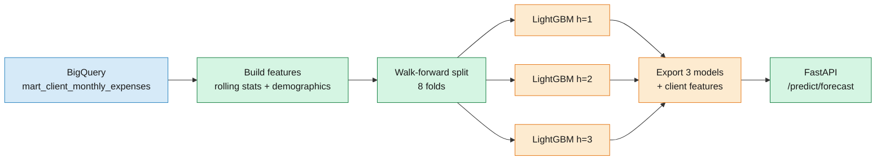

# Expense Forecasting Model

Global LightGBM with direct multi-step forecasting. R2=0.76 at a theoretical ceiling of ~0.80.

## Why This Model Exists

While the [fraud detection model](3-ml-fraud-detection.md) identifies suspicious transactions, this model addresses a different question: how much will a client spend next month? Accurate expense forecasting enables budgeting tools, credit risk assessment, and proactive customer engagement.

The core challenge here isn't class imbalance (as with fraud), but signal scarcity. Most of the variance in monthly spending comes from *who* the client is, not *when* they spend. This document explains the direct multi-step approach, the ceiling analysis that proved R2=0.76 is the practical limit, and what would need to change to push beyond it.

## Problem

Predict each client's total monthly expenses for the next 1, 2, and 3 months. The dataset has ~2,000 clients with varying transaction histories from 2010 to 2019.

### Metrics

**R2 Score (Coefficient of Determination)**: measures how much of the variance in actual expenses the model explains. An R2 of 1.0 means perfect prediction; 0.0 means the model is no better than predicting the overall mean.

$$R^2 = 1 - \frac{\sum_{i}(y_i - \hat{y}_i)^2}{\sum_{i}(y_i - \bar{y})^2}$$

where $y_i$ is the actual expense, $\hat{y}_i$ is the predicted expense, and $\bar{y}$ is the mean of all actual expenses.

**MAE (Mean Absolute Error)**: the average dollar amount the predictions are off by. More interpretable than R2 for business stakeholders.

$$\text{MAE} = \frac{1}{n}\sum_{i}|y_i - \hat{y}_i|$$

**RMSE (Root Mean Squared Error)**: similar to MAE but penalizes large errors more heavily.

$$\text{RMSE} = \sqrt{\frac{1}{n}\sum_{i}(y_i - \hat{y}_i)^2}$$

## Background: Direct vs Recursive Forecasting

When predicting multiple steps ahead, there are two strategies:

**Recursive forecasting** trains a single model to predict one step ahead ($t+1$). To predict $t+2$, you feed the prediction for $t+1$ back as an input feature. Each step compounds the error of the previous one.

**Direct forecasting** trains a separate model for each horizon. The $h=1$ model predicts expenses at $t+1$, the $h=2$ model predicts expenses at $t+2$, and the $h=3$ model predicts expenses at $t+3$. All models use features computed at time $t$ only.

We chose direct forecasting because:
1. **No error propagation**: each model makes an independent prediction from actual data
2. **Autocorrelation ≈ 0**: there's no temporal structure for recursive to exploit. Each month's expenses are nearly independent of the previous month (confirmed by EDA)
3. **Simplicity**: three independent models, no feedback loops, easy to debug

### Walk-forward validation

Instead of a single train/test split, we use **walk-forward validation** with 8 folds. Each fold trains on all data up to month $t$ and evaluates on month $t+1$ (or $t+2$, $t+3$ for the respective horizon models). This simulates how the model would perform in production, where you always train on the past and predict the future.

## Features

The forecast model uses features from [`mart_client_monthly_expenses`](../dbt/models/marts/mart_client_monthly_expenses.sql) plus rolling statistics computed in [`predict_model.py`](../src/models/predict_model.py):

| Category | Features | Intuition |
|----------|----------|-----------|
| **Rolling stats** | `rmean_3`, `rmean_6`, `rmean_12`, `rstd_3`, `rstd_6`, `rmin_6`, `rmax_6`, `range_6` | Captures the client's spending level and volatility |
| **Momentum** | `momentum_1` (MoM change), `momentum_3`, `trend_3v6` (short vs long term) | Detects if spending is accelerating or decelerating |
| **Spending patterns** | `earn_expense_ratio`, `zero_freq_6m`, `cv_6` (coefficient of variation) | Distinguishes stable vs volatile spenders |
| **Demographics** | `yearly_income`, `total_debt`, `credit_score`, `per_capita_income`, `debt_to_income_ratio` | Client-level context that explains between-client variance |

All rolling features use `shift(1)` or `shift(lag)` to avoid data leakage. Features at time $t$ are computed from data up to $t-1$ only.

## Results

### Walk-forward validation (8 folds)

| Horizon | R2 | MAE ($) | RMSE ($) |
|---------|------|---------|----------|
| h=1 | 0.7612 | 238.73 | 313.58 |
| h=2 | 0.7613 | 238.18 | 311.95 |
| h=3 | 0.7629 | 239.99 | 314.36 |
| **Overall** | **0.7618** | **238.97** | |

Performance is nearly identical across horizons, confirming that autocorrelation is negligible. Predicting 3 months ahead is as easy (or hard) as predicting 1 month ahead.

In dollar terms: the model is off by about $239 on average. For a client who spends $500/month, that's a ~48% error. For a client who spends $2,000/month, it's ~12%. The model is most useful for high-spending, stable clients.

## Ceiling Analysis: Why R2=0.76 Can't Get Better

The initial experiment reported R2=0.96. A deep audit revealed this was inflated by rolling features computed on the full history before splitting. After fixing the leakage, honest R2 dropped to 0.76.

### Variance decomposition

| Component | % of Total Variance |
|-----------|-------------------|
| **Between-client** (spending level) | 77% |
| **Learnable signal** (model improvement over client mean) | ~17% |
| **Irreducible noise** | ~6% |

**77% of total variance is explained by simply knowing WHO the client is**, their average spending level. A model that predicts each client's historical mean achieves R2=0.75. The LightGBM model squeezes out an additional ~0.01 by capturing rolling trends and demographics.

### Seven alternative approaches (all converge to ~0.76)

| Approach | R2 |
|----------|------|
| LightGBM (4 hyperparameter configs) | 0.760–0.762 |
| Client 12-month rolling mean baseline | 0.750 |
| EWMA blend (weighted lags) | 0.702 |
| Residual modeling (predict deviation from mean) | 0.760 |
| Two-stage: P(zero) × E[expense\|nonzero] | 0.761 |
| Huber loss | 0.015 (needs different alpha) |

When fundamentally different approaches converge to the same metric, you've hit the **dataset's ceiling**.

### Why the ceiling exists

- **Within-client autocorrelation ≈ 0**: knowing a client spent $500 last month tells you almost nothing about next month
- **Year-over-year seasonality ≈ 0**: no month-of-year effect detected (YoY correlation = -0.002)
- **57% of clients are volatile** (CV > 0.7): their month-to-month variation is noise, not signal
- **The remaining ~24% of variance is irreducible**: random spending decisions, life events, external factors

Further improvement would require external data (holidays, promotions, macroeconomic indicators) or transaction-level features that capture spending intent.

## What the Model Actually Learns

Top features by importance:

1. `earn_expense_ratio`: clients with higher earnings-to-expenses ratio have more predictable spending
2. `rmean_6`, `rmean_12`: rolling means capture the client's stable spending level
3. `yearly_income`: demographics disambiguate between clients
4. `rstd_6`: spending volatility predicts how uncertain the forecast will be
5. `momentum_1`: short-term spending trends provide marginal signal

The model effectively learns: **"predict each client's spending level (from rolling means + demographics), adjusted slightly by recent momentum."** This is the correct behavior given the variance structure.

## Serving via FastAPI

The forecast models are served through a FastAPI endpoint on Cloud Run at `/predict/forecast`. See [`app/routers/forecast.py`](../app/routers/forecast.py) for the implementation.

### How a request flows

1. **Client sends a POST** with `client_id`
2. **Feature lookup**: the endpoint looks up the client's pre-computed feature vector from `client_features.pkl` (computed during model export from the last available month of data)
3. **Three predictions**: each horizon model (`forecast_h1.pkl`, `forecast_h2.pkl`, `forecast_h3.pkl`) predicts independently
4. **Floor at zero**: predictions are clamped to `max(0, prediction)` since negative expenses don't make sense
5. **Response**: returns 3 monthly predictions with horizon and amount

Unlike the fraud endpoint (which builds features on-the-fly), the forecast endpoint uses **pre-computed client features**. This is because the rolling statistics (rmean_6, momentum_1, etc.) depend on the full transaction history and can't be computed from a single request.

### Production considerations

In a real system, the client feature vectors would be recomputed nightly (or on each dbt run) and stored in a feature store or cache. The current approach of baking them into a `.pkl` file works but becomes stale as new transactions arrive. You'd also want confidence intervals alongside point predictions (e.g., using quantile regression or conformal prediction) so downstream consumers know how much to trust each forecast.

## Architecture

## Code Reference

| File | Purpose |
|------|---------|
| [`src/models/predict_model.py`](../src/models/predict_model.py) | Feature engineering + walk-forward validation |
| [`scripts/export_models.py`](../scripts/export_models.py) | Train on full data, export `forecast_h{1,2,3}.pkl` |
| [`app/routers/forecast.py`](../app/routers/forecast.py) | Serving: client feature lookup, 3-horizon prediction |
| [`experiments.md`](8-experiments.md) | Full experiment log (2 forecasting experiments) |
| [`dbt/models/marts/mart_client_monthly_expenses.sql`](../dbt/models/marts/mart_client_monthly_expenses.sql) | Monthly aggregation SQL |
