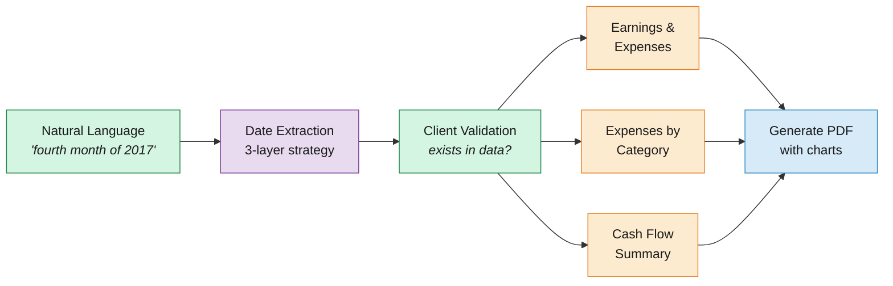

# AI Agent: Financial Report Generation

Natural language prompt → date extraction → data analysis → PDF report.

## Why This Component Exists

The fraud detection and expense forecasting models produce numbers. But a bank analyst doesn't want to run SQL queries to get a client's financial summary. They want to say *"Create a report for the fourth month of 2017"* and get a PDF with charts and tables.

This agent bridges that gap. It takes a natural language prompt, extracts a date range, validates the client, runs three analysis functions, and generates a PDF report with earnings/expenses charts, expense breakdowns by category, and cash flow summaries.

The interesting engineering challenge isn't the report generation itself, it's making the date extraction **reliable**. LLMs are good at understanding natural language but can hallucinate dates or return malformed JSON. The 3-layer fallback strategy (Vertex AI → Ollama → regex) ensures the agent always works, even when the LLM doesn't.

## Architecture



## The 3-Layer LLM Strategy

The agent needs to turn free-text prompts into structured `(start_date, end_date)` pairs. Three backends are available, controlled by the `AGENT_LLM_BACKEND` environment variable:

| Layer | Backend | When to use | Reliability |
|-------|---------|-------------|-------------|
| 1 | **Vertex AI Gemini** | Production with GCP credentials | High, but adds latency and cost |
| 2 | **Ollama** (llama3.2:1b) | Local development | Good, requires Ollama running |
| 3 | **Regex fallback** | Default, always available | Deterministic, handles all test cases |

The fallback logic: the configured backend is tried first. If it returns `None` or malformed dates, the agent falls back to regex automatically. The `backend_used` field in the response tracks which layer actually succeeded (e.g., `"ollama"`, `"regex"`, or `"ollama+regex_fallback"`).

### Why regex is the default

In the Cloud Run deployment, `AGENT_LLM_BACKEND` is set to `"regex"`. This means:
- No LLM calls, no API costs, no latency from model inference
- All 3 tests pass deterministically in CI/CD
- The regex patterns cover every prompt format the hackathon tests use

Vertex AI and Ollama are scaffolded for future use. Activating them is a one-line env var change.

### What the regex understands

The regex fallback ([`src/agent/tools.py`](../src/agent/tools.py)) handles these prompt patterns:

| Pattern | Example | Extracted |
|---------|---------|-----------|
| Explicit ISO range | `"from 2018-01-01 to 2018-05-31"` | `2018-01-01` → `2018-05-31` |
| Two ISO dates | `"between 2018-01-01 and 2018-05-31"` | `2018-01-01` → `2018-05-31` |
| Ordinal month | `"the fourth month of 2017"` | `2017-04-01` → `2017-04-30` |
| Month name | `"january 2020"` | `2020-01-01` → `2020-01-31` |
| Ordinal quarter | `"the third quarter of 2019"` | `2019-07-01` → `2019-09-30` |
| Q notation | `"Q2 2021"` | `2021-04-01` → `2021-06-30` |
| Full year | `"annual report for 2018"` | `2018-01-01` → `2018-12-31` |

Month-end dates are computed correctly (e.g., February in leap years). Quarter boundaries map to standard fiscal quarters (Q1=Jan-Mar, Q2=Apr-Jun, Q3=Jul-Sep, Q4=Oct-Dec).

### LLM prompt template

When using Vertex AI or Ollama, the agent sends this prompt:

```
Extract the start date and end date from the user's request.
Return ONLY a JSON object with start_date and end_date in YYYY-MM-DD format.

Examples:
User: Create a pdf report for the fourth month of 2017
Answer: {"start_date": "2017-04-01", "end_date": "2017-04-30"}

User: Create a pdf report from 2018-01-01 to 2018-05-31
Answer: {"start_date": "2018-01-01", "end_date": "2018-05-31"}
...

User: {input}
Answer:
```

The response is parsed as JSON. If the LLM returns extra text around the JSON (common with smaller models), the parser searches for a `{...}` pattern and extracts it.

## Report Generation

Once dates are extracted and the client is validated (exists in the dataset), the agent runs three analysis functions and combines their outputs into a PDF.

### Data analysis functions

All three functions live in [`src/data/data_functions.py`](../src/data/data_functions.py) and operate on the raw transactions DataFrame:

**`earnings_and_expenses(df, client_id, start_date, end_date)`**
- Computes total earnings (positive amounts) vs total expenses (negative amounts) for the period
- Produces a bar chart saved to `reports/figures/earnings_and_expenses.png`
- Returns a single-row DataFrame with `Earnings` and `Expenses` columns

**`expenses_summary(df, client_id, start_date, end_date)`**
- Breaks down expenses by merchant category (MCC codes joined from `data/raw/mcc_codes.json`)
- Produces a category bar chart saved to `reports/figures/expenses_summary.png`
- Returns a DataFrame with columns: `Expenses Type`, `Total Amount`, `Average`, `Max`, `Min`, `Num. Transactions`

**`cash_flow_summary(df, client_id, start_date, end_date)`**
- Tracks inflows vs outflows over time, grouped by week (if period ≤ 60 days) or month (if longer)
- Computes net cash flow and savings rate as a percentage
- Returns a DataFrame with columns: `Date`, `Inflows`, `Outflows`, `Net Cash Flow`, `% Savings`
- No chart generated for this function (data only)

### PDF structure

The PDF is generated with [`fpdf2`](https://py-pdf.github.io/fpdf2/) and contains three sections:

1. **Earnings & Expenses**: summary table + bar chart
2. **Expenses by Category**: breakdown table + category bar chart
3. **Cash Flow Summary**: periodic inflows/outflows table

The file is saved as `reports/report_client_{id}_{start}_to_{end}.pdf`.

## FastAPI Endpoint

The agent is served at `POST /report/generate` via [`app/routers/agent.py`](../app/routers/agent.py).

**Request:**
```json
{
  "client_id": 122,
  "prompt": "Create a report for the fourth month of 2017"
}
```

**Response:**
```json
{
  "client_id": 122,
  "start_date": "2017-04-01",
  "end_date": "2017-04-30",
  "backend_used": "regex",
  "message": "Dates extracted: 2017-04-01 to 2017-04-30 for client 122"
}
```

Note: the API endpoint only extracts dates and returns them. The full report generation (data analysis + PDF) runs in the `run_agent()` function in [`src/agent/agent.py`](../src/agent/agent.py), which is called by the test suite directly with a DataFrame. In a production setup, the endpoint would trigger the full pipeline.

## Tests

Three test cases in [`tests/agent_test.py`](../tests/agent_test.py) validate the complete flow:

| Test | Prompt | Client | Pattern Tested | Expected Result |
|------|--------|--------|----------------|-----------------|
| 1 | `"fourth month of 2017"` | 122 (valid) | Ordinal month | PDF generated, dates = Apr 2017 |
| 2 | `"from 2018-01-01 to 2018-05-31"` | 1352 (valid) | Explicit ISO range | PDF generated |
| 3 | `"from 2018-01-01 to 2018-05-31"` | 7000 (invalid) | Client validation | No PDF (client doesn't exist) |

Run with `make test`. All 3 pass with the regex backend (no LLM required).

## Code Reference

| File | Purpose |
|------|---------|
| [`src/agent/agent.py`](../src/agent/agent.py) | Main orchestrator: date extraction → validation → analysis → PDF |
| [`src/agent/tools.py`](../src/agent/tools.py) | Date extraction (LLM + regex), PDF generation |
| [`src/data/data_functions.py`](../src/data/data_functions.py) | Three analysis functions (earnings, expenses, cash flow) |
| [`app/routers/agent.py`](../app/routers/agent.py) | FastAPI endpoint with 3-layer backend selection |
| [`tests/agent_test.py`](../tests/agent_test.py) | 3 test cases covering ordinal, ISO, and invalid client |
