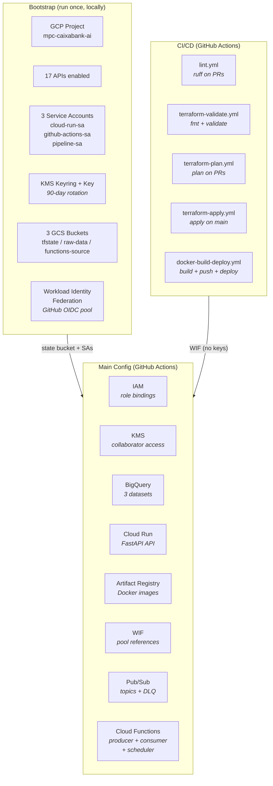

# Infrastructure as Code

Terraform-managed GCP infrastructure with Workload Identity Federation, SOPS/KMS secrets, and GitHub Actions CI/CD.

## Architecture



## Two-Phase Terraform

### Why two phases

Terraform has a chicken-and-egg problem: the remote state backend (GCS bucket) and the CI/CD service account must exist before Terraform can run via GitHub Actions. The solution is a **bootstrap phase** that creates the foundation locally:

| Phase | What | Where | When |
|-------|------|-------|------|
| **Bootstrap** | GCP project, APIs, KMS, service accounts, WIF, state bucket | `terraform/bootstrap/` | Once, locally |
| **Main** | BigQuery, Cloud Run, Artifact Registry, Pub/Sub, Cloud Functions | `terraform/` | Every merge to main, via GitHub Actions |

### Bootstrap ([`terraform/bootstrap/main.tf`](../terraform/bootstrap/main.tf))

Creates the project-level foundation:

**GCP Project:** `mpc-caixabank-ai` with `auto_create_network = false` (serverless only, no VPC needed).

**17 APIs enabled:** storage, bigquery, run, cloudbuild, iam, cloudkms, artifactregistry, cloudtrace, billingbudgets, iamcredentials, sts, cloudresourcemanager, aiplatform, cloudfunctions, cloudscheduler, pubsub, eventarc.

**3 Service Accounts:**

| SA | Purpose | Created In | Managed In |
|----|---------|-----------|------------|
| `cloud-run-sa` | FastAPI runtime identity | Bootstrap | IAM module |
| `github-actions-sa` | CI/CD via Workload Identity | Bootstrap | IAM module |
| `pipeline-sa` | Ingestion pipeline (Cloud Functions) | Bootstrap | IAM module |

**KMS:** `sops-keyring` (global) with `sops-key` (90-day auto-rotation, `prevent_destroy = true`). Used by SOPS to encrypt/decrypt `terraform.tfvars.enc`.

**3 GCS Buckets:**
- `mpc-caixabank-ai-tf-state` -- Terraform remote state (versioned, uniform access)
- `mpc-caixabank-ai-raw-data` -- Large CSV uploads (1.2GB transactions file)
- `mpc-caixabank-ai-functions-source` -- Cloud Function zip archives (force_destroy)

**Workload Identity Federation:**
- Pool: `github-pool`
- Provider: `github-provider` (OIDC issuer: `token.actions.githubusercontent.com`)
- Attribute condition: restricts to our specific repository
- Binding: allows the WIF identity to impersonate `github-actions-sa`

### Main Config ([`terraform/main.tf`](../terraform/main.tf))

Orchestrates 8 modules, passing outputs between them:

```hcl
module "cloud_run" {
  source             = "./modules/cloud_run"
  cloud_run_sa_email = module.iam.cloud_run_sa_email  # From IAM module
  ...
}

module "cloud_functions" {
  pipeline_sa_email  = module.iam.pipeline_sa_email   # From IAM module
  pubsub_topic_name  = module.pubsub.topic_name       # From Pub/Sub module
  ...
}
```

## Module Breakdown

| Module | Resources | Purpose |
|--------|-----------|---------|
| **[iam](../terraform/modules/iam/)** | Data sources for 3 SAs + `google_project_iam_member` bindings | Least-privilege role management |
| **[kms](../terraform/modules/kms/)** | Data sources for keyring/key + collaborator access | SOPS encryption for secrets |
| **[bigquery](../terraform/modules/bigquery/)** | 3 datasets (landing, logic, presentation) | Data warehouse structure |
| **[cloud_run](../terraform/modules/cloud_run/)** | `google_cloud_run_v2_service` + public IAM | API deployment |
| **[artifact_registry](../terraform/modules/artifact_registry/)** | Docker repository + cleanup policies | Image storage |
| **[workload_identity](../terraform/modules/workload_identity/)** | Pool/provider name construction | WIF references for CI/CD |
| **[pubsub](../terraform/modules/pubsub/)** | Ingestion topic + DLQ topic | Message bus |
| **[cloud_functions](../terraform/modules/cloud_functions/)** | Producer + Consumer functions, Scheduler, source zips | Ingestion pipeline |

Each module follows the pattern:
```
modules/{name}/
├── main.tf       # Resource definitions
├── variables.tf  # Input variables (always project_id + region)
└── outputs.tf    # Exported values for other modules
```

## Workload Identity Federation

The most important security decision: **no service account keys anywhere**.

Traditional approach: create a service account key JSON, store it as a GitHub Secret, authenticate with `gcloud auth activate-service-account --key-file`. Problems: keys don't expire (unless manually rotated), can be leaked, and are a compliance risk.

WIF approach:
1. GitHub Actions requests an OIDC token from GitHub's token service
2. The token is exchanged with GCP's Security Token Service (STS)
3. STS validates the token against the WIF pool/provider configuration
4. If the token's repository claim matches the attribute condition, a short-lived access token is issued
5. Terraform/gcloud use the short-lived token (expires in 1 hour)

```yaml
# From .github/workflows/terraform-apply.yml
- id: auth
  uses: google-github-actions/auth@v2
  with:
    workload_identity_provider: ${{ secrets.WIF_PROVIDER }}
    service_account: ${{ secrets.GH_ACTIONS_SA_EMAIL }}
```

No keys stored, rotated, or leaked. The only GitHub Secrets are the WIF provider name and SA email (non-sensitive identifiers).

## SOPS + KMS Secrets Management

Sensitive variables (project ID, billing account) are encrypted with SOPS using GCP KMS:

```yaml
# .sops.yaml
creation_rules:
  - path_regex: terraform/.*\.tfvars$
    gcp_kms: projects/mpc-caixabank-ai/locations/global/keyRings/sops-keyring/cryptoKeys/sops-key
```

The encrypted file `terraform/terraform.tfvars.enc` is committed to the repo. In CI/CD:

```bash
sops --decrypt terraform.tfvars.enc > terraform.tfvars
```

Only identities with `roles/cloudkms.cryptoKeyDecrypter` on the KMS key can decrypt. The `github-actions-sa` has this role; collaborators can be granted access via the KMS Terraform module.

## CI/CD Workflows

| Workflow | Trigger | Auth | Gate |
|----------|---------|------|------|
| [`lint.yml`](../.github/workflows/lint.yml) | PRs (`.py` changes) | None | Ruff check + format |
| [`terraform-validate.yml`](../.github/workflows/terraform-validate.yml) | PRs (`terraform/**`) | None | `terraform fmt` + `validate` |
| [`terraform-plan.yml`](../.github/workflows/terraform-plan.yml) | PRs (`terraform/**`) | WIF + SOPS | Plan posted as PR comment |
| [`terraform-apply.yml`](../.github/workflows/terraform-apply.yml) | Push to main | WIF + SOPS | `production` environment (manual approval) |
| [`docker-build-deploy.yml`](../.github/workflows/docker-build-deploy.yml) | Push to main (`app/**`, `src/**`) | WIF | Build → Artifact Registry → Cloud Run |

The `production` GitHub Environment requires manual approval before `terraform apply` runs, preventing accidental infrastructure changes.

## Service Account Strategy

Each workload has a dedicated SA with only the roles it needs:

**cloud-run-sa** (API runtime):
- `bigquery.dataViewer`, `bigquery.jobUser` -- read BigQuery for queries
- `cloudtrace.agent` -- send traces
- `aiplatform.user` -- Vertex AI scaffold (inactive)

**github-actions-sa** (CI/CD):
- `storage.objectAdmin` -- state bucket + raw data
- `artifactregistry.writer` -- push Docker images
- `run.admin` -- deploy Cloud Run
- `cloudkms.cryptoKeyDecrypter` -- SOPS decrypt
- `iam.serviceAccountUser` -- impersonate cloud-run-sa for deployments
- `viewer` -- read project resources for `terraform plan`

**pipeline-sa** (ingestion):
- `bigquery.dataEditor`, `bigquery.jobUser` -- write to BigQuery
- `pubsub.publisher`, `pubsub.subscriber` -- Pub/Sub operations
- `run.invoker`, `eventarc.eventReceiver` -- function invocation
- `storage.objectAdmin` -- read CSV + read/write cursor

## Cost: Always Free Tier

| Service | Usage | Free Tier | Cost |
|---------|-------|-----------|------|
| BigQuery storage | ~3 GB | 10 GB/mo | $0 |
| BigQuery queries | <100 GB/mo | 1 TB/mo | $0 |
| Cloud Run | Low traffic | 2M requests/mo | $0 |
| Cloud Functions | ~100K invocations/mo | 2M/mo | $0 |
| Pub/Sub | ~20 MB/mo | 10 GB/mo | $0 |
| Cloud Scheduler | 1 job | 3 jobs/mo | $0 |
| Artifact Registry | ~500 MB | 500 MB/mo | $0 |
| GCS | ~2 GB | 5 GB/mo | $0 |

**Total: $0/month.** The entire infrastructure runs within GCP's Always Free tier.

## Running Terraform

```bash
# Bootstrap (one-time, local)
cd terraform/bootstrap
terraform init
terraform apply -var-file=bootstrap.tfvars

# Main config
cd terraform
terraform init
sops --decrypt terraform.tfvars.enc > terraform.tfvars
terraform plan
terraform apply

# Or via GitHub Actions (merge to main triggers apply)
```
