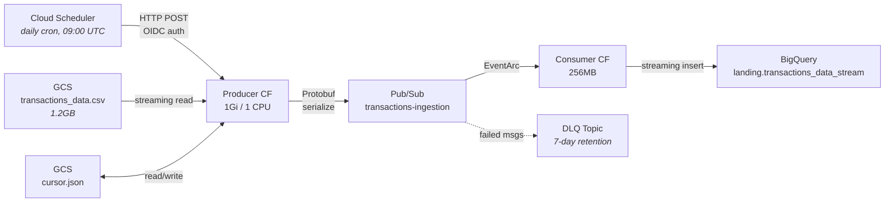

# Data Ingestion Pipeline

Cloud Scheduler → Producer Cloud Function → Pub/Sub (Protobuf) → Consumer Cloud Function → BigQuery

## Architecture



The pipeline ingests 13M credit card transactions from a 1.2GB CSV in GCS, processing them in time-ordered 30-day chunks. Each invocation publishes one month of transactions as Protobuf messages to Pub/Sub. The consumer function streams each message into BigQuery via streaming inserts.

## Design Decisions

### Why Protobuf over JSON

JSON would work, but Protobuf provides:

- **Schema enforcement** at the serialization boundary -- malformed data is caught before it enters Pub/Sub, not after
- **Smaller payloads** -- ~40% smaller than equivalent JSON, reducing Pub/Sub message costs
- **Schema versioning** -- the `.proto` file is a versioned contract between producer and consumer. Adding a field doesn't break the consumer
- **Portfolio signal** -- demonstrates awareness of data contracts in distributed systems

The schema is defined in [`proto/transaction.proto`](../proto/transaction.proto) with 12 fields matching the raw CSV:

```protobuf
message Transaction {
  int64 id = 1;
  string date = 2;           // "2010-01-01 00:01:00"
  string amount = 5;         // "$-77.00" (raw, parsed downstream by dbt)
  string use_chip = 6;       // "Chip Transaction" | "Swipe Transaction" | "Online Transaction"
  int64 mcc = 11;            // Merchant Category Code
  string errors = 12;        // error type or empty
  // ... 6 more fields
}
```

Fields preserve the raw CSV format intentionally. Parsing (e.g., `"$-77.00"` to float) is handled by dbt's staging layer, keeping the ingestion pipeline format-agnostic.

### Why time-based chunking

The CSV has 13.3M rows spanning 3,590 days (Jan 2010 -- Oct 2019). Loading everything at once would:

1. Exceed Cloud Function memory (even at 1Gi, the full CSV is 1.2GB)
2. Publish 13M Pub/Sub messages in one burst, overwhelming the consumer
3. Take longer than the 5-minute Cloud Function timeout

Instead, each invocation processes a **30-day window** (~100K rows). The cursor advances after each successful batch, so the next invocation picks up where it left off. At one invocation per day, the full dataset ingests in ~120 days -- or the schedule can be accelerated.

### Cursor tracking in GCS

State is tracked via a simple JSON file in GCS:

```json
{"last_timestamp": "2010-01-30 23:59:00"}
```

Why GCS instead of a database or Firestore:
- **No extra service** -- reuses the existing GCS bucket (`mpc-caixabank-ai-raw-data`)
- **Atomic reads/writes** -- a single JSON object, no concurrency issues with max_instance_count=1
- **Inspectable** -- `gsutil cat gs://bucket/pipeline/cursor.json` shows exactly where ingestion stopped

The cursor always advances to `chunk_end` even if zero rows are found, preventing infinite loops on empty date ranges.

### Dead Letter Queue

The DLQ topic (`transactions-ingestion-dlq`) catches messages that exhaust EventArc's retry policy. In practice, failures are rare (the consumer's only operation is a BigQuery streaming insert), but the DLQ demonstrates production-grade error handling:

- Main topic: **no retention** (messages consumed immediately)
- DLQ topic: **7-day retention** (time to investigate and replay failed messages)

## Code Walkthrough

### Producer ([`functions/producer/main.py`](../functions/producer/main.py))

The producer is an HTTP-triggered Cloud Function called by Cloud Scheduler. Its flow:

1. **Read cursor** from GCS -- get the last processed timestamp
2. **Stream the CSV** from GCS line-by-line using `blob.open("r")` (never loads the full 1.2GB into memory)
3. **Skip rows** at or before the cursor timestamp (string comparison works because timestamps are ISO-formatted)
4. **Stop** when rows exceed `cursor + CHUNK_DAYS`
5. **Serialize** each row to a Protobuf `Transaction` message
6. **Publish** to Pub/Sub, collecting futures for async confirmation
7. **Wait** for all publishes to complete
8. **Update cursor** in GCS

Key implementation details:

- **Streaming reads**: `blob.open("r")` streams the CSV line-by-line. The previous version used `blob.download_as_text()` which loaded the full 1.2GB into memory and crashed the function (512MB limit). This was caught during deployment and fixed.
- **Error handling**: Malformed rows are logged and skipped, not crashed on. One bad row doesn't lose the entire batch.
- **String timestamp comparison**: Since the CSV is ordered by timestamp and timestamps are ISO-formatted (`YYYY-MM-DD HH:MM:SS`), string comparison preserves chronological order without datetime parsing overhead for 13M rows.

### Consumer ([`functions/consumer/main.py`](../functions/consumer/main.py))

The consumer is triggered by EventArc on each Pub/Sub message:

1. **Decode** the base64-encoded Pub/Sub message data from the CloudEvent envelope
2. **Deserialize** the Protobuf `Transaction` message
3. **Convert** to a BigQuery row dict (handling type conversions like `zip` string → float)
4. **Streaming insert** to `landing.transactions_data_stream`

The `_safe_float()` helper handles the zip field gracefully -- empty strings become `None`, invalid values don't crash the function.

## Terraform Deployment

### Modules

Two Terraform modules manage the pipeline:

**[`terraform/modules/pubsub/`](../terraform/modules/pubsub/)** -- Creates the ingestion topic and DLQ topic.

**[`terraform/modules/cloud_functions/`](../terraform/modules/cloud_functions/)** -- The most complex module:

- **Source packaging**: `archive_file` data source zips function directories, `google_storage_bucket_object` uploads with content-hash in the filename (forces redeployment when code changes)
- **Producer function**: HTTP trigger, 1Gi memory, 1 CPU, 300s timeout
- **Consumer function**: EventArc Pub/Sub trigger, 256MB, 60s timeout, max 3 instances
- **Cloud Scheduler**: Daily cron at 09:00 UTC with OIDC authentication
- **Pub/Sub service agent IAM**: Grants `roles/iam.serviceAccountTokenCreator` to the Pub/Sub service agent (required for EventArc push to Gen2 functions)

### IAM

The pipeline uses a dedicated `pipeline-sa` service account with least-privilege roles:

| Role | Purpose |
|------|---------|
| `bigquery.dataEditor` | Write to `landing.transactions_data_stream` |
| `bigquery.jobUser` | Run streaming insert jobs |
| `pubsub.publisher` | Publish messages to topic |
| `pubsub.subscriber` | EventArc subscription |
| `run.invoker` | Scheduler invokes producer; EventArc invokes consumer |
| `eventarc.eventReceiver` | Receive EventArc triggers |
| `storage.objectAdmin` | Read CSV + read/write cursor in GCS |

## Operational Notes

### Lessons learned during deployment

1. **Cloud Scheduler region**: `europe-southwest1` (Madrid) doesn't support Cloud Scheduler. We hardcoded `europe-west1` for the scheduler job while keeping functions in `europe-southwest1`. Cross-region HTTP calls work fine.

2. **Memory sizing**: The initial 512MB allocation crashed on `blob.open("r")` because Python's CSV reader still buffers internally. 1Gi with 1 CPU resolved this. The memory/CPU ratio must satisfy Cloud Run's constraints (1Gi requires at least 1 CPU).

3. **Cloud Build permissions**: Gen2 Cloud Functions require the default compute service account to have `roles/cloudbuild.builds.builder`. This isn't documented prominently and caused deployment failures until manually granted.

4. **Consumer backpressure**: Publishing 97K messages in a burst overwhelmed the consumer at max 3 instances. EventArc's retry policy handles this gracefully -- messages are redelivered until the consumer catches up. In production, you'd increase `max_instance_count` or batch messages in the consumer.

5. **Cursor overwrite**: `storage.objectCreator` is insufficient to overwrite an existing GCS object -- you need `storage.objects.delete`. We upgraded to `storage.objectAdmin`.

### Running manually

```bash
# Compile Protobuf schema
make proto-compile

# Trigger producer (requires gcloud auth)
make trigger-ingestion

# Check cursor state
gsutil cat gs://mpc-caixabank-ai-raw-data/pipeline/cursor.json

# Check ingested rows
bq query --use_legacy_sql=false \
  "SELECT COUNT(*) FROM landing.transactions_data_stream"

# Pause/resume scheduler
gcloud scheduler jobs pause daily-transaction-ingestion --location=europe-west1
gcloud scheduler jobs resume daily-transaction-ingestion --location=europe-west1
```
