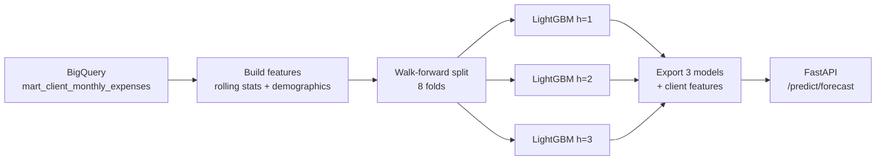

# Expense Forecasting Model

Global LightGBM with direct multi-step forecasting. R2=0.76 at a theoretical ceiling of ~0.80.

## Problem

Predict each client's total monthly expenses for the next 1, 2, and 3 months. The dataset has ~2,000 clients with varying transaction histories from 2010--2019.

**Metric:** R2 score (walk-forward validated).

## Approach: Direct Multi-Step Forecasting

Instead of recursive forecasting (predict month t+1, feed it back to predict t+2), we train **three separate models** -- one per horizon:

- **h=1**: predict expenses at t+1 given features at t
- **h=2**: predict expenses at t+2 given features at t
- **h=3**: predict expenses at t+3 given features at t

Why direct over recursive:
1. **No error propagation** -- recursive forecasting compounds prediction errors across horizons
2. **Autocorrelation ≈ 0** -- there's no temporal structure for recursive to exploit. Each month's expenses are nearly independent of the previous month
3. **Simplicity** -- three independent models, no feedback loops

## Features

The forecast model uses features from [`mart_client_monthly_expenses`](../dbt/models/marts/mart_client_monthly_expenses.sql) plus rolling statistics computed in [`predict_model.py`](../src/models/predict_model.py):

| Category | Features |
|----------|----------|
| **Rolling stats** | `rmean_3`, `rmean_6`, `rmean_12` (rolling means), `rstd_3`, `rstd_6` (rolling std), `rmin_6`, `rmax_6`, `range_6` |
| **Momentum** | `momentum_1` (MoM change), `momentum_3`, `trend_3v6` (short vs long term) |
| **Spending patterns** | `earn_expense_ratio`, `zero_freq_6m` (frequency of zero-expense months), `cv_6` (coefficient of variation) |
| **Demographics** | `yearly_income`, `total_debt`, `credit_score`, `per_capita_income`, `debt_to_income_ratio` |

All rolling features use `shift(1)` or `shift(lag)` to avoid data leakage -- features at time t are computed from data up to t-1 only.

## Results

### Walk-forward validation (8 folds)

| Horizon | R2 | MAE ($) | RMSE ($) |
|---------|------|---------|----------|
| h=1 | 0.7612 | 238.73 | 313.58 |
| h=2 | 0.7613 | 238.18 | 311.95 |
| h=3 | 0.7629 | 239.99 | 314.36 |
| **Overall** | **0.7618** | **238.97** | -- |

Performance is nearly identical across horizons -- confirming that autocorrelation is negligible (predicting 3 months ahead is as easy/hard as predicting 1 month ahead).

## Ceiling Analysis: Why R2=0.76 Can't Get Better

The initial experiment reported R2=0.96. A deep audit revealed this was inflated by rolling features computed on the full history before splitting. After fixing the leakage:

### Variance decomposition

| Component | % of Total Variance |
|-----------|-------------------|
| **Between-client** (spending level) | 77% |
| **Learnable signal** (model improvement over client mean) | ~17% |
| **Irreducible noise** | ~6% |

**77% of total variance is explained by simply knowing WHO the client is** -- their average spending level. A model that predicts each client's historical mean achieves R2=0.75. The LightGBM model squeezes out an additional ~0.01 by capturing rolling trends and demographics.

### Seven alternative approaches (all converge to ~0.76)

| Approach | R2 |
|----------|------|
| LightGBM (4 hyperparameter configs) | 0.760--0.762 |
| Client 12-month rolling mean baseline | 0.750 |
| EWMA blend (weighted lags) | 0.702 |
| Residual modeling (predict deviation from mean) | 0.760 |
| Two-stage (P(zero) x E[expense\|nonzero]) | 0.761 |
| Huber loss | 0.015 (needs different alpha) |

When fundamentally different approaches converge to the same metric, you've hit the **dataset's ceiling**.

### Why the ceiling exists

- **Within-client autocorrelation ≈ 0** -- knowing a client spent $500 last month tells you almost nothing about next month
- **Year-over-year seasonality ≈ 0** -- no month-of-year effect detected (YoY correlation = -0.002)
- **57% of clients are volatile** (CV > 0.7) -- their month-to-month variation is noise, not signal
- **The remaining ~24% of variance is irreducible** -- random spending decisions, life events, external factors

Further improvement would require external data (holidays, promotions, macroeconomic indicators) or transaction-level features that capture spending intent.

## What the Model Actually Learns

Top features by importance:

1. `earn_expense_ratio` -- clients with higher earnings-to-expenses ratio have more predictable spending
2. `rmean_6`, `rmean_12` -- rolling means capture the client's stable spending level
3. `yearly_income` -- demographics disambiguate between clients
4. `rstd_6` -- spending volatility predicts how uncertain the forecast will be
5. `momentum_1` -- short-term spending trends provide marginal signal

The model effectively learns: **"predict each client's spending level (from rolling means + demographics), adjusted slightly by recent momentum."** This is the correct behavior given the variance structure.

## Architecture

## Code Reference

| File | Purpose |
|------|---------|
| [`src/models/predict_model.py`](../src/models/predict_model.py) | Feature engineering + walk-forward validation |
| [`scripts/export_models.py`](../scripts/export_models.py) | Train on full data, export `forecast_h{1,2,3}.pkl` |
| [`app/routers/forecast.py`](../app/routers/forecast.py) | Serving: client feature lookup, 3-horizon prediction |
| [`experiments.md`](../experiments.md) | Full experiment log (2 forecasting experiments) |
| [`dbt/models/marts/mart_client_monthly_expenses.sql`](../dbt/models/marts/mart_client_monthly_expenses.sql) | Monthly aggregation SQL |
