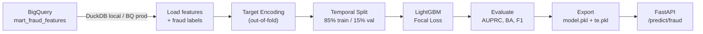

# Fraud Detection Model

LightGBM + Focal Loss + Out-of-Fold Target Encoding on 13M transactions with 0.15% fraud rate.

## Problem

13.3 million credit card transactions spanning 2010--2019. Fraud rate: **0.15%** (1 in 665 transactions). The challenge is extreme class imbalance -- a model that predicts "no fraud" for every transaction achieves 99.85% accuracy but catches zero fraud.

**Metrics that matter:**
- **AUPRC** (Area Under Precision-Recall Curve) -- the primary metric for imbalanced classification. Ranges 0-1, where baseline = fraud rate (0.0015).
- **Balanced Accuracy** -- hackathon evaluation metric. Average of recall per class.
- **Production F1** -- precision-recall tradeoff at the operating threshold.

## The Experiment Journey

9 experiments, from underfitting to production-grade. Full details in [`experiments.md`](../experiments.md).

| Exp | Change | AUPRC | Key Insight |
|-----|--------|-------|-------------|
| 1 | Naive LightGBM baseline | ~0 | No features, no class handling |
| 2 | `scale_pos_weight=10` | 0.22 | Class weights help but plateau |
| 3 | Velocity features | 0.21 | Features alone aren't enough without proper imbalance handling |
| 4 | EDA-driven features (errors, geographic) | 0.43 | **Biggest jump** -- `has_bad_cvv` = 23x fraud rate, `is_online` = 28x |
| 5 | Out-of-fold target encoding | 0.49 | `mcc_te` became #1 feature (importance 2818) |
| 6 | **Focal loss** (gamma=2.0, alpha=0.25) | 0.58 | **+19%** -- both precision and recall improved |
| 7 | Ensemble stacking | 0.02 | **Failed** -- temporal distribution shift broke the meta-learner |
| 8 | Deep features + leakage detection | 0.61 | Zip features leaked (+0.30 AUPRC); ablation study caught it |
| 9 | Behavioral patterns | 0.60 | 9 new features added noise; LightGBM already captures interactions |

**Final model:** Exp 8 (fixed) -- BA=0.97, AUPRC=0.61, F1=0.60. Production operating point: **64% precision, 57% recall** (for every 10 alerts, ~6 are real fraud; we catch 57% of all fraud).

## Key Techniques

### Focal Loss

The single largest improvement (+19% AUPRC). Replaced `scale_pos_weight` tuning entirely.

**Why `scale_pos_weight` isn't enough:** It uniformly upweights ALL positive samples by a constant factor. Easy-to-classify fraud (obvious patterns) gets the same weight as hard-to-classify fraud (subtle patterns). The gradient is dominated by the easy cases.

**Why focal loss works:** It multiplies the loss by `(1 - pt)^gamma` where `pt` is the model's confidence. Correctly classified examples (high `pt`) get near-zero weight. Hard, misclassified examples get full weight. The gradient concentrates where the model is struggling.

```python
# From src/models/train_model.py
FOCAL_GAMMA = 2.0
FOCAL_ALPHA = 0.25

def focal_loss_objective(y_true, y_pred):
    p = 1.0 / (1.0 + np.exp(-y_pred))  # sigmoid
    pt = np.where(y_true == 1, p, 1 - p)
    focal_weight = FOCAL_ALPHA * (1 - pt) ** FOCAL_GAMMA
    grad = focal_weight * (p - y_true)
    hess = focal_weight * p * (1 - p)
    return grad, hess
```

LightGBM accepts custom objectives, so this integrates directly. The tradeoff: focal loss returns raw logits, not probabilities. The serving layer must apply sigmoid to convert to [0, 1].

### Out-of-Fold Target Encoding

Categorical features `mcc` (Merchant Category Code) and `merchant_id` have thousands of unique values. One-hot encoding would create thousands of sparse columns. Target encoding maps each category to its smoothed fraud rate.

The naive approach (compute fraud rate per category on the full training set) leaks the target into the features. Out-of-fold encoding prevents this:

1. Split training data into K folds
2. For each fold, compute the smoothed fraud rate from the OTHER K-1 folds:
   ```
   encoded = (n_fraud + alpha * global_mean) / (n_total + alpha)
   ```
3. Apply to the held-out fold
4. For test/serving data, use the full training set mapping

The smoothing parameter `alpha=10` pulls rare categories toward the global mean, preventing overfitting on categories with few observations.

After target encoding, `mcc_te` became the #1 feature by importance (2818 splits) -- the model learned which merchant categories are riskiest.

### Feature Engineering from EDA

The biggest improvements came from domain-informed features, not model tuning:

- **Error flags** (Exp 4): EDA showed `has_bad_cvv` transactions have 23x the base fraud rate. Parsing the raw error string into 7 boolean columns was the highest-ROI feature work.
- **Channel features** (Exp 4): `is_online` transactions have 28x the fraud rate vs. swipe transactions.
- **Combined signals** (Exp 8): `online_new_merchant` (online AND first time at this merchant) captures a compound risk pattern the model can't easily learn from individual features.

## Leakage Detection

### The zip feature incident

Experiment 8 initially produced AUPRC=0.89 -- a suspiciously large jump from 0.58. The ablation study (adding one feature at a time) revealed the source:

| Feature | AUPRC | Delta |
|---------|-------|-------|
| Baseline (Exp 6) | 0.5724 | -- |
| **+is_different_zip** | **0.8726** | **+0.30 LEAKAGE** |
| +oos_new_merchant | 0.6028 | +0.030 (legitimate) |
| +gap_zscore | 0.5821 | +0.010 |

**Root cause:** The `client_home_zip` CTE in the dbt mart computed each client's most frequent zip from ALL transactions -- past AND future. For a 2012 training transaction, the model could see zip patterns from 2019. Since the train/val split is temporal, the zip features became a proxy for "which time period is this from?", not genuine fraud signal.

**Confirmation:** `is_different_zip` had an **inverse** correlation with fraud -- fraud was MORE common at the home zip (0.21% vs 0.04% elsewhere). The model was exploiting the temporal leak, not geographic patterns.

**Fix:** Removed all zip-based features. Honest AUPRC dropped to 0.61 -- still +7% over the prior experiment from legitimate features (card_age_months, gap_zscore, oos_new_merchant).

**Lesson:** When using temporal data splits, validate that every feature is computable at prediction time using only historical data. Ablation studies are the fastest diagnostic.

### Temporal validation

The model uses an 85/15 temporal split (not random). Training data comes from earlier time periods; validation from later periods. This prevents the model from learning patterns that wouldn't exist at serving time.

All `shift()` operations use `shift(1)` or `shift(lag)` to ensure features are computed from past data only.

## Failed Approaches

### Ensemble stacking (Exp 7)

LightGBM + XGBoost + Logistic Regression meta-learner with a 3-way temporal split (70/15/15). AUPRC collapsed from 0.58 to 0.02.

**Root cause:** The stacking set (middle 15%) landed in a period with 0.06% fraud rate (vs 0.15% overall). The meta-learner trained on a fundamentally different distribution than the validation set.

**Lesson:** Ensemble stacking with temporal data requires comparable fraud rates across all splits -- or you need stratified temporal sampling.

### Behavioral features (Exp 9)

Added 9 features: `spend_acceleration`, `channel_switched`, `card_testing_pattern`, `burst_diversity`, etc. AUPRC decreased from 0.6149 to 0.6045.

**Lesson:** LightGBM already captures non-linear interactions between existing features. Explicit interaction features can add noise without signal. Only `prev_txn_amount` barely contributed.

## Production Operating Point

The model optimizes two thresholds:

- **BA-optimal** (threshold=0.08): BA=0.97, Recall=0.98 -- catches almost all fraud but floods analysts with false positives
- **F1-optimal** (threshold=0.37): F1=0.60, **Precision=0.64, Recall=0.57** -- the production operating point

At the production threshold: for every 10 flagged transactions, ~6 are actual fraud. The model catches 57% of all fraud. This is a usable system for a fraud investigation team.

## Architecture



## Code Reference

| File | Purpose |
|------|---------|
| [`src/models/train_model.py`](../src/models/train_model.py) | Training pipeline: load, encode, split, train, evaluate |
| [`scripts/export_models.py`](../scripts/export_models.py) | Retrain on full data, serialize model + encodings |
| [`app/routers/fraud.py`](../app/routers/fraud.py) | Serving: build feature vector, apply TE, predict, sigmoid |
| [`experiments.md`](../experiments.md) | Full experiment log (9 experiments, ablation studies) |
| [`dbt/models/marts/mart_fraud_features.sql`](../dbt/models/marts/mart_fraud_features.sql) | 60+ feature SQL (377 lines) |
