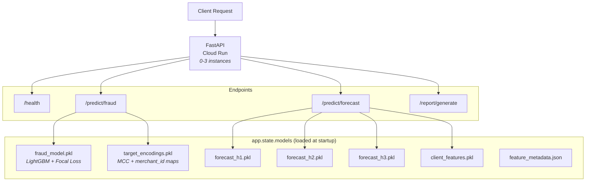

# API Serving Layer

FastAPI on Cloud Run with real-time fraud predictions, expense forecasts, and AI-generated reports.

## Architecture



## Application Structure

| File | Purpose |
|------|---------|
| [`app/main.py`](../app/main.py) | FastAPI app with lifespan context manager |
| [`app/model_loader.py`](../app/model_loader.py) | Loads all pkl models and metadata at startup |
| [`app/schemas.py`](../app/schemas.py) | Pydantic request/response models |
| [`app/routers/health.py`](../app/routers/health.py) | `/health` endpoint |
| [`app/routers/fraud.py`](../app/routers/fraud.py) | `/predict/fraud` endpoint |
| [`app/routers/forecast.py`](../app/routers/forecast.py) | `/predict/forecast` endpoint |
| [`app/routers/agent.py`](../app/routers/agent.py) | `/report/generate` endpoint |

## Model Loading with Lifespan

Models are loaded **once at startup** using FastAPI's lifespan context manager, not on every request:

```python
@asynccontextmanager
async def lifespan(app: FastAPI):
    models = load_models()
    app.state.models = models
    yield
```

`load_models()` deserializes all pkl files from `outputs/models/` into a dict stored in `app.state.models`. Each router accesses models via `request.app.state.models` -- no global variables, clean dependency injection.

## Endpoint Deep Dives

### `/predict/fraud`

The fraud endpoint accepts a transaction's features and returns a fraud probability with a binary decision.

**Request flow:**

1. **Receive** `FraudRequest` (Pydantic validates: amount, use_chip, mcc, merchant_id, etc.)
2. **Build feature vector** -- compute derived features inline:
   - `abs_amount = abs(amount)`
   - `log_amount = log(abs(amount) + 1)`
   - `is_expense = int(amount < 0)`
3. **Apply target encoding** -- look up `mcc` and `merchant_id` in the pre-computed encoding maps. Unseen categories fall back to the global mean (production safety).
4. **Construct DataFrame** -- fill missing features with 0 (the model was trained with all 55 features; the API only receives a subset)
5. **Predict** -- `model.predict(df)` returns raw logits (not probabilities, because the model uses focal loss as a custom objective)
6. **Sigmoid correction** -- convert logits to probability: `prob = 1 / (1 + exp(-raw_score))`
7. **Threshold** -- `is_fraud = prob >= 0.35`

**Why sigmoid correction is needed:** LightGBM with a custom objective (focal loss) outputs raw logits, not probabilities. The built-in `predict()` doesn't apply sigmoid automatically. Missing this step would give values like -3.2 instead of 0.04.

### `/predict/forecast`

Accepts a `client_id` and returns predicted expenses for the next 3 months.

1. **Look up** client features from the pre-loaded `client_features` dict (computed during model export from the last available month)
2. **Predict** with each horizon model (h=1, h=2, h=3)
3. **Return** 3 monthly predictions with amounts

### `/report/generate`

AI-powered financial report generation with a 3-layer LLM strategy:

1. **Vertex AI Gemini** (scaffold, inactive by default) -- production-grade but incurs API costs
2. **Ollama** (local) -- for development, runs any open-source model locally
3. **Regex fallback** (default) -- deterministic date extraction from natural language prompts like "Create a report for the fourth month of 2017"

The active backend is controlled by the `AGENT_LLM_BACKEND` environment variable. The regex fallback passes all tests without any LLM dependency.

## Deployment

### Docker

```dockerfile
FROM python:3.10-slim
WORKDIR /app
COPY requirements.txt .
RUN pip install --no-cache-dir -r requirements.txt
COPY src/ src/
COPY app/ app/
COPY outputs/models/ outputs/models/
EXPOSE 8080
CMD ["uvicorn", "app.main:app", "--host", "0.0.0.0", "--port", "8080"]
```

Model artifacts are baked into the Docker image at build time. This means model updates require a new image build and deploy -- the [Production Roadmap](../README.md#production-roadmap) notes that a model registry (Vertex AI Model Registry) would decouple model versions from deployments.

### Cloud Run

Deployed via Terraform ([`terraform/modules/cloud_run/`](../terraform/modules/cloud_run/)):

| Setting | Value | Why |
|---------|-------|-----|
| **CPU** | 2 | LightGBM prediction + pandas DataFrame construction |
| **Memory** | 2Gi | Model deserialization + feature metadata in memory |
| **Min instances** | 0 | Scale to zero when idle (cost savings) |
| **Max instances** | 3 | Portfolio project, not production scale |
| **Startup probe** | `/health`, 5s delay | Waits for model loading before accepting traffic |
| **Liveness probe** | `/health`, 30s period | Restarts container if health check fails |
| **Access** | Public (allUsers) | Portfolio project, no auth required |

The service account is `cloud-run-sa` with `bigquery.dataViewer` + `bigquery.jobUser` (for potential BigQuery queries from the agent endpoint).

## API Reference

```bash
# Health check
curl http://localhost:8080/health

# Fraud prediction
curl -X POST http://localhost:8080/predict/fraud \
  -H "Content-Type: application/json" \
  -d '{"transaction_id": "123", "amount": -150.0, "use_chip": "Online Transaction",
       "mcc": 5411, "merchant_id": 100, "is_online": 1, "txn_hour": 3,
       "credit_limit": 5000}'

# Expense forecast
curl -X POST http://localhost:8080/predict/forecast \
  -H "Content-Type: application/json" \
  -d '{"client_id": 0}'

# Report generation
curl -X POST http://localhost:8080/report/generate \
  -H "Content-Type: application/json" \
  -d '{"client_id": 0, "prompt": "Create a report for the fourth month of 2017"}'
```

## Running Locally

```bash
# With uvicorn (hot reload)
make serve          # http://localhost:8080/docs

# With Docker
make docker-build
make docker-run     # http://localhost:8080/docs

# With docker-compose
make docker-compose-up
make docker-compose-down
```

The FastAPI docs UI at `/docs` provides interactive API exploration with request/response schemas.
